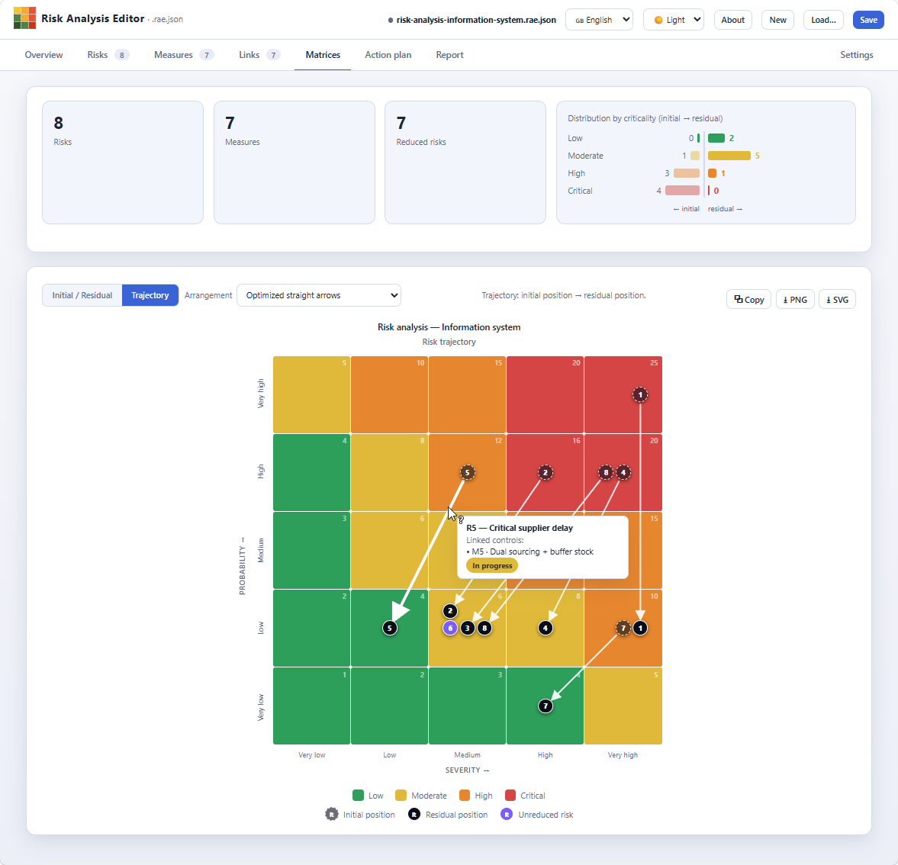

#  Risk Analysis Editor (RAE)

[English](README.md) · **Français**

Outil autonome de **construction et de visualisation de matrices de risque** — risque initial (brut) et risque résiduel (net) — avec un format de fichier ouvert et documenté, le `.rae.json`.

### ▶️ [Ouvrir l'application](https://stephanev.github.io/Risk-Analysis-Editor/app/risk-analysis-editor.html) · 📊 [Démo EBIOS RM](https://stephanev.github.io/Risk-Analysis-Editor/app/risk-analysis-editor.html?file=../examples/demo-ebios-rm-systeme-d-information.rae.json) · 🛡️ [Démo AIPD](https://stephanev.github.io/Risk-Analysis-Editor/app/risk-analysis-editor.html?file=../examples/demo-aipd-sst.rae.json) · ⬇️ [Télécharger](https://github.com/StephaneV/Risk-Analysis-Editor/releases/latest/download/risk-analysis-editor.html)

*Aucune installation : l'outil s'exécute entièrement dans votre navigateur. Deux démos prêtes à ouvrir : une analyse de risques **inspirée d'EBIOS RM** (12 risques, 11 mesures) et une **AIPD suivant la méthode PIA de la CNIL** pour un service de santé au travail (12 risques, 12 mesures) — toutes deux illustrant descriptions, notes, **tags** colorés, **barres de progression**, responsables et justifications de liens. Le téléchargement fournit **l'unique fichier HTML** de la [dernière version](https://github.com/StephaneV/Risk-Analysis-Editor/releases/latest) : double-cliquez-le pour travailler **hors-ligne**.*

> *Vue **Matrices › Trajectoire** : chaque flèche relie la position initiale (contour pointillé) à la position résiduelle (contour plein) d'un risque.*

---

## Présentation

**Risk Analysis Editor** est une application web **autonome** : un unique fichier HTML, sans aucune dépendance externe, qui fonctionne **hors-ligne** (un simple double-clic suffit, sans installation ni serveur).

Elle permet de mener une analyse de risque complète : définir une grille de cotation, saisir des risques et des mesures de maîtrise, relier les deux, puis **visualiser** le passage du risque **initial** au risque **résiduel** sous forme de matrices ou de trajectoires fléchées.

L'outil est **indépendant de toute méthodologie** (ISO 27005, EBIOS RM, AIPD/PIA CNIL, référentiel interne…) : la grille (taille, libellés, seuils, couleurs, méthode de calcul) est entièrement paramétrable et enregistrée dans le fichier.

Toute l'analyse tient dans un fichier **`.rae.json`** autoportant : grille, risques, mesures, liens et cotations initiale/résiduelle. Le format est **spécifié** ([documentation technique](specs/SPEC-format-analyse-risque.md)) et validé par un **schéma JSON** ([schema-analyse-risque.json](specs/schema-analyse-risque.json)). Les noms de propriétés sont en anglais ; les valeurs (libellés, descriptions) restent dans la langue de l'analyse.

**Point d'entrée :** [ouvrir l'application en ligne](https://stephanev.github.io/Risk-Analysis-Editor/app/risk-analysis-editor.html) — ou, pour un usage **hors-ligne**, télécharger le dépôt et ouvrir [`app/risk-analysis-editor.html`](app/risk-analysis-editor.html) par un simple double-clic.

---

## Fonctionnalités

### Visualisation
- **Deux matrices côte à côte** : risque *initial (brut)* et risque *résiduel (net)*.
- **Vue Trajectoire** : une flèche relie la position initiale à la position résiduelle de chaque risque ; les risques non réduits sont mis en évidence.
- **Dispositions optimisées** des trajectoires : flèches droites, minimisation des croisements et des chevauchements, grille carrée centrée.
- **Stratégies de disposition des pastilles** lorsqu'une case contient plusieurs risques : grille, rangée, colonne, amas/spirale, débordement « +N »…
- **Placement manuel** des pastilles en glisser-déposer, avec grille d'accroche (*snap* N×N paramétrable) et positions enregistrées dans le fichier.
- **Statistiques** : répartition par niveau de criticité (initial → résiduel), nombre de risques réduits.

### Grille de cotation
- **Axes paramétrables** (vertical / horizontal) : nombre de niveaux libre, libellés et descriptions en infobulle.
- **Méthodes de calcul du score** : produit (P × G), somme (P + G) ou **matrice** (niveau défini case par case, avec éditeur dédié).
- **Niveaux de criticité** : zones colorées, seuils, couleur, décision d'acceptation et description, avec **contrôle de couverture** des scores atteignables.
- **Transposition des axes** (vertical ↔ horizontal) en un clic, cotations et placements inclus.

### Saisie
- **Présentation** : onglet dédié aux métadonnées documentaires de l'analyse (titre, statut, auteur, organisation, périmètre, référence méthodologique, description) et aux valeurs des champs personnalisés de niveau analyse.
- **Registre des risques** : catégorie, propriétaire, description, évaluation initiale et résiduelle, indicateur d'évolution.
- **Mesures de maîtrise** : nature (technique / organisationnelle…), statut (avec code couleur), responsable, échéance, coût.
- **Liens risques ↔ mesures**, en deux sous-onglets : *Associations* (tableau croisé à cocher, plusieurs-à-plusieurs) et *Détails* (registre éditable où chaque lien porte une **note** et ses propres **champs personnalisés**) ; les liens enrichis sont signalés dans le tableau croisé.
- **Plan d'action** : suivi des mesures via trois présentations (échéancier, kanban par statut, groupé par responsable), mesures **en retard** mises en évidence (échéance passée et non finalisée), et **avancement global** (barre + compteurs par statut). Chaque mesure est **éditable au clic** (échéance, statut, responsable, notes, champs personnalisés) et, dans le kanban, se **glisse-dépose** d'une colonne de statut à l'autre.
- **Champs personnalisés** : définissez dans *Paramètres* des champs supplémentaires rattachés à l'analyse, aux risques, aux mesures ou aux liens — 10 types (oui/non, entier, décimal, date, texte, liste déroulante, liste à cocher, **tags colorés** en choix unique/multiple, **barre de progression** en %), libellés multilingues (le libellé et l'aide se saisissent dans la langue de l'interface active ; à défaut de traduction, le code est affiché), caractère obligatoire et bornes (min/max, longueur, nombre d'items) ; les valeurs se saisissent dans les fiches (risques, mesures) et dans l'onglet *Présentation* (champs de l'analyse), avec validation, et sont reprises dans le **rapport** et dans l'**import/export CSV**.
- **Import CSV** des risques, des mesures et des liens : colonnes nommées d'après les clés **anglaises** du format, séparateur auto-détecté ; fusion par identifiant (risques/mesures) ; contrôle d'intégrité et déduplication (liens).
- **Export CSV des risques, des mesures et des liens** : en-têtes = noms de clés **anglais** (identiques quelle que soit la langue de l'interface), délimiteur `;` et BOM UTF-8 (Excel), avec colonnes dérivées en lecture seule (score/criticité pour les risques ; risques couverts pour les mesures ; libellés pour les liens) ; ré-importable.
- **Tri et filtrage** des listes Risques, Mesures et Plan d'action : recherche texte, tri par clic sur les colonnes, et filtres déroulants (catégorie, type, statut, responsable, « en retard uniquement »).
- **Aides à la saisie & filets de sécurité** : **duplication** en un clic (⧉) d'un risque ou d'une mesure, **« Enregistrer et nouveau »** pour la saisie en série, toast **« Annuler »** après chaque suppression, pastilles R*x*/M*x* cliquables ouvrant la fiche référencée, option *« ne plus demander »* sur les confirmations de liens, avertissement à la modification d'une grille déjà cotée, et panneau **Aide & raccourcis** (menu Fichier, ou touche `?`).
- **Colonnes personnalisables** dans les registres Risques, Mesures et Détail des liens : afficher/masquer des colonnes et les réordonner (glisser les en-têtes, ou flèches ▲/▼ du menu ⚙), faire apparaître des champs sinon masqués (propriétaire, échéance, coût…) et ajouter des colonnes de **champ personnalisé**. Les colonnes ID et Actions restent épinglées ; la disposition est **enregistrée dans le fichier** (`extensions.display.columns`).

### Fichier & export
- **Nouveau / Charger / Enregistrer** au format `.rae.json`.
- **Chargement par URL** : ouvrir l'outil avec `?file=<url>` (alias `?url=`) charge automatiquement l'analyse pointée au démarrage — par ex. `risk-analysis-editor.html?file=../examples/analyse-de-risques-systeme-d-information.rae.json`. Nécessite que l'outil soit servi via HTTP(S) (le protocole `file://` bloque cette lecture).
- **Paramètres d'URL au démarrage** (combinables) : `?lang=fr|en|it` force la langue de l'interface (prioritaire sur la langue enregistrée dans le fichier et sur celle du navigateur) ; `?tab=<onglet>[.<sous-onglet>]` ouvre un onglet donné, et éventuellement son sous-onglet — par ex. `?tab=matrices.traj` (Matrices › Trajectoire), `?tab=settings.grid`, `?tab=plan`. Les valeurs inconnues sont ignorées.
- **Export image** des matrices : **PNG** (résolution ×1 / ×2 / ×3) et **SVG**, copie dans le presse-papiers, avec titre, sous-titre, libellés d'axes et légende.
- **Export Word (.docx)** du rapport et **export Excel (.xlsx)** de l'analyse : menu *Fichier* (et bouton dans l'onglet *Rapport* pour Word). Le fichier Word reprend la structure du rapport imprimable — métadonnées, présentation, synthèse, grille, **matrices en images intégrées**, registres et fiches détaillées — prêt à fondre dans un gabarit d'entreprise ; le classeur Excel comporte quatre feuilles stylées (Synthèse / Risques / Mesures / Liens) avec cellules typées (vraies dates et nombres), couleurs de criticité et de statut, en-têtes figés et filtres automatiques. Le tout est généré **localement, hors-ligne** : OOXML écrit maison plus la bibliothèque MIT [fflate](https://github.com/101arrowz/fflate) incorporée pour le conteneur ZIP — toujours un seul fichier HTML, sans dépendance externe.
- **Rapport imprimable** : onglet *Rapport* générant un document complet (métadonnées, **bloc Présentation** avec la description et les champs personnalisés de l'analyse, synthèse, grille et niveaux de criticité avec descriptions, matrices Initial/Résiduel et Trajectoire en vectoriel, registre des risques, listes détaillées des risques et des mesures avec leurs descriptions **et valeurs de champs personnalisés**, liens), rendu en style clair et imprimable (→ PDF via le navigateur).

### Personnalisation
- **Thèmes** : sombre, clair.
- **Sélecteur de langue** : français / anglais / italien (interface et données par défaut d'une nouvelle analyse), architecture extensible à d'autres langues.

---

## Structure du projet

| Dossier | Contenu |
|---|---|
| [`app/`](app/) | L'application (`risk-analysis-editor.html`). |
| [`specs/`](specs/) | **Spécifications** : spécification du format de fichier, schéma JSON et stratégies de disposition. La documentation utilisateur vivra ailleurs. |
| [`examples/`](examples/) | Analyses d'exemple au format `.rae.json` (français et anglais), dont deux **démos complètes** : une analyse de risques **inspirée d'EBIOS RM** (`demo-ebios-rm-*.rae.json`) et une **AIPD suivant la méthode PIA de la CNIL** pour un service de santé au travail (`demo-aipd-sst.rae.json` / `demo-dpia-ohs.rae.json`) — avec tags colorés, barres de progression, responsables et liens justifiés. |
| [`templates/`](templates/) | **Modèles méthodologiques** (`xxx.template.<lang>.rae.json`, un fichier par langue) : squelettes vierges — grille, niveaux de criticité et champs personnalisés préconfigurés, sans risque ni mesure. **EBIOS RM**, **AIPD — CNIL PIA**, **ISO/IEC 27005** et un modèle **générique** 5×5, chacun en **français, anglais et italien**. Listés sous *Démarrer d'un modèle* dans le bloc d'amorçage (le fichier correspondant à la langue de l'interface est chargé) ; l'ouverture (depuis là ou via *Charger…*) démarre une nouvelle analyse **non reliée**. On peut aussi transformer l'analyse courante en modèle via **Fichier › Enregistrer comme modèle…**, et revenir au bloc d'amorçage via **Fichier › Écran d'accueil**. |

---

## Prise en main

1. [Ouvrir l'application en ligne](https://stephanev.github.io/Risk-Analysis-Editor/app/risk-analysis-editor.html) — ou ouvrir [`app/risk-analysis-editor.html`](app/risk-analysis-editor.html) depuis une copie locale, dans un navigateur récent.
2. L'outil démarre sur une **analyse vierge**, ouverte sur l'onglet **Présentation**.
3. Bouton **Charger…** pour ouvrir un fichier `.rae.json` (par ex. depuis [`examples/`](examples/)), **Enregistrer** pour exporter le vôtre.

---

## Compatibilité navigateurs

**Prérequis** : un navigateur de bureau récent (version à jour) avec JavaScript activé — rien d'autre. Aucun serveur, aucun accès réseau ni installation ne sont nécessaires ; l'application se lance d'un double-clic en `file://`. Seul le **chargement par URL** (`?file=…`) demande que l'outil soit servi en HTTP(S).

Le développement et les tests sont réalisés principalement avec **Microsoft Edge (Chromium)** ; tout navigateur basé sur Chromium (Chrome, Edge, Opera, Brave…) offre l'expérience complète. Différences connues avec les autres moteurs :

- **Firefox / Safari** — l'API File System Access (`showSaveFilePicker`) n'y est pas disponible : *Enregistrer* se replie sur un **téléchargement** classique du fichier `.rae.json` (et *Charger* sur un sélecteur de fichier standard) au lieu d'écrire directement dans le fichier ouvert. Tout le reste fonctionne à l'identique.
- **Firefox ancien (< 127)** — la copie d'une matrice dans le presse-papiers **sous forme d'image** (`ClipboardItem`) n'est pas prise en charge ; les boutons de téléchargement PNG et SVG restent disponibles.
- **Appareils tactiles** — les interactions en glisser-déposer (pastilles, kanban, en-têtes de colonnes) visent un usage à la souris ; des alternatives clavier et menu existent (Ctrl+flèches dans le kanban et les matrices, flèches ▲/▼ du menu de colonnes), mais l'outil est conçu pour un usage bureau.

---

## Crédits

RAE embarque exactement **une bibliothèque tierce** : [**fflate** v0.8.2](https://github.com/101arrowz/fflate) (licence MIT, © Arjun Barrett), une implémentation ZIP/deflate minuscule et rapide. Elle fournit le conteneur ZIP requis par les exports Word (`.docx`) et Excel (`.xlsx`) — les fichiers OOXML étant des archives ZIP de parties XML. La bibliothèque est **incorporée** dans le fichier HTML, avec sa notice de licence, afin que l'application reste pleinement hors-ligne et sans dépendance externe. Tout le reste (moteur Markdown, export SVG/PNG, génération OOXML, composants d'interface) est écrit sur mesure pour ce projet.

---

## Licence

Distribué sous licence **MIT** — voir [`LICENSE`](LICENSE).

© 2026 Stéphane Vinter
