 Guide utilisateur — Risk Analysis Editor (RAE)

Ce guide décrit l'utilisation complète de **Risk Analysis Editor**, l'éditeur d'analyses de risques au format ouvert `.rae.json`. Il commence par une **prise en main rapide**, puis détaille **chaque écran et chaque fonction**.

> Toutes les captures d'écran illustrent l'analyse de démonstration **« AIPD — Système d'information du service de santé au travail »** (fictive), livrée avec l'outil : [`examples/demo-aipd-sst.rae.json`](../examples/demo-aipd-sst.rae.json). Interface en français, thème clair. Vous pouvez l'ouvrir pour reproduire pas à pas ce qui est décrit ici.

---

## Sommaire

1. [Introduction](#1-introduction)
2. [Prise en main en quelques minutes](#2-prise-en-main-en-quelques-minutes)
3. [L'interface générale](#3-linterface-générale)
4. [Paramétrer la grille de cotation](#4-paramétrer-la-grille-de-cotation)
5. [Décrire l'analyse (onglet Présentation)](#5-décrire-lanalyse-onglet-présentation)
6. [Le registre des risques](#6-le-registre-des-risques)
7. [Les mesures de maîtrise](#7-les-mesures-de-maîtrise)
8. [Les liens risques ↔ mesures](#8-les-liens-risques--mesures)
9. [Les matrices](#9-les-matrices)
10. [Le plan d'action](#10-le-plan-daction)
11. [Le rapport](#11-le-rapport)
12. [Les champs personnalisés](#12-les-champs-personnalisés)
13. [Rechercher, trier, filtrer, personnaliser les colonnes](#13-rechercher-trier-filtrer-personnaliser-les-colonnes)
14. [Import et export CSV](#14-import-et-export-csv)
15. [Exports Word et Excel](#15-exports-word-et-excel)
16. [Gérer les fichiers et les modèles](#16-gérer-les-fichiers-et-les-modèles)
17. [Raccourcis clavier et accessibilité](#17-raccourcis-clavier-et-accessibilité)
18. [Compatibilité navigateurs](#18-compatibilité-navigateurs)
19. [Format de fichier et interopérabilité](#19-format-de-fichier-et-interopérabilité)
20. [Questions fréquentes et astuces](#20-questions-fréquentes-et-astuces)

---

## 1. Introduction

**Risk Analysis Editor** est une application web **autonome** : un unique fichier HTML, sans aucune dépendance ni serveur, qui fonctionne **hors-ligne**. Un simple double-clic sur le fichier l'ouvre dans votre navigateur.

Elle permet de mener une analyse de risque complète :

- définir une **grille de cotation** (axes, niveaux, méthode de calcul du score, zones de criticité) ;
- saisir des **risques**, les **coter** avant et après traitement (risque **initial/brut** → risque **résiduel/net**) ;
- décrire des **mesures de maîtrise** et les **relier** aux risques ;
- **visualiser** le résultat sous forme de matrices et de trajectoires, **suivre** le plan d'action et **produire** un rapport.

L'outil est **indépendant de toute méthodologie** : il fournit les briques génériques (grille configurable, registres, liens, champs personnalisés) qui permettent de construire une analyse **EBIOS RM**, **AIPD (CNIL PIA)**, **ISO 27005** ou selon un référentiel interne. Toute l'analyse tient dans un fichier `.rae.json` autoportant, que vous pouvez enregistrer, partager et rouvrir.

**Public visé :** responsables des risques, RSSI, analystes sécurité, DPO, consultants GRC — aucune compétence technique n'est requise.

---

## 2. Prise en main en quelques minutes

À l'ouverture, tant qu'aucune analyse n'est chargée, l'application affiche un **écran d'accueil** qui résume le parcours.

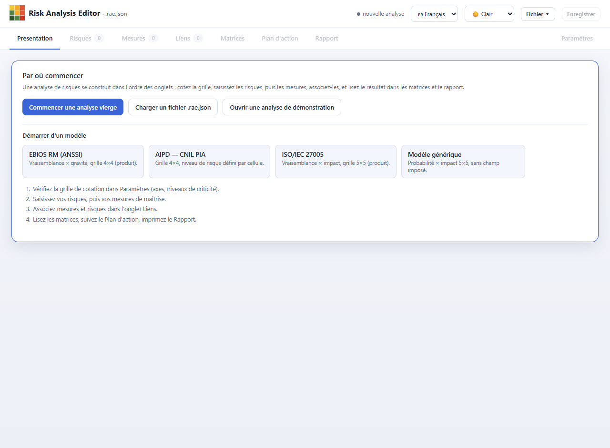

Vous avez quatre points de départ :

- **Commencer une analyse vierge** — une grille par défaut, à personnaliser ;
- **Charger un fichier .rae.json** — reprendre une analyse existante ;
- **Ouvrir une analyse de démonstration** — un exemple complet pour explorer ;
- **Démarrer d'un modèle** — un squelette méthodologique préconfiguré (EBIOS RM, AIPD — CNIL PIA, ISO/IEC 27005, ou générique).

Le parcours conseillé se lit dans l'ordre des onglets :

1. **Vérifiez la grille de cotation** dans *Paramètres* (axes, niveaux de criticité).
2. **Saisissez vos risques**, puis vos **mesures** de maîtrise.
3. **Associez** mesures et risques dans l'onglet *Liens*.
4. **Lisez les matrices**, suivez le *Plan d'action*, imprimez le *Rapport*.

Chaque étape est détaillée dans les sections suivantes.

---

## 3. L'interface générale

### La barre supérieure

En haut de la fenêtre :

- le **logo** et le nom de l'application ;
- l'**état du document** au centre : le nom du fichier lié (par ex. `demo-aipd-sst.rae.json`) et une pastille **« modifié »** dès qu'une modification n'est pas enregistrée ;
- le sélecteur de **langue** de l'interface (Français / English / Italiano) ;
- le sélecteur de **thème** (Clair / Sombre) ;
- le menu **Fichier** (voir §16) ;
- le bouton **Enregistrer**, qui écrit les modifications dans le fichier `.rae.json`.

### Les onglets

La navigation se fait par onglets : **Présentation**, **Risques**, **Mesures**, **Liens**, **Matrices**, **Plan d'action**, **Rapport**, et **Paramètres** (à droite). Les onglets Risques, Mesures et Liens affichent un **compteur** du nombre d'éléments.

### Enregistrement et sécurité des données

- **Enregistrement.** Le bouton *Enregistrer* (ou `Ctrl+S`) écrit dans le fichier. Selon le navigateur, il écrit directement dans le fichier ouvert, ou propose un téléchargement (voir §18).
- **Sauvegarde automatique.** L'outil conserve en arrière-plan une copie de travail : si vous fermez l'onglet par accident, il vous **propose de restaurer** l'analyse non enregistrée à la réouverture.
- **Garde anti-perte de saisie.** Si vous fermez une fiche en cours d'édition par un clic à côté, la touche `Échap` ou la croix ✕ alors que vous avez commencé à saisir, l'outil demande **confirmation** avant d'abandonner vos modifications. Le bouton *Annuler* de la fiche, lui, ferme directement.
- **Avertissement de fermeture.** Si des modifications ne sont pas enregistrées, le navigateur vous avertit avant de quitter la page.

---

## 4. Paramétrer la grille de cotation

L'onglet **Paramètres** comporte quatre sous-onglets : *Affichage des matrices*, *Grille de cotation*, *Champs personnalisés* et *Rapport* (voir [§11](#11-le-rapport)).

### Grille de cotation

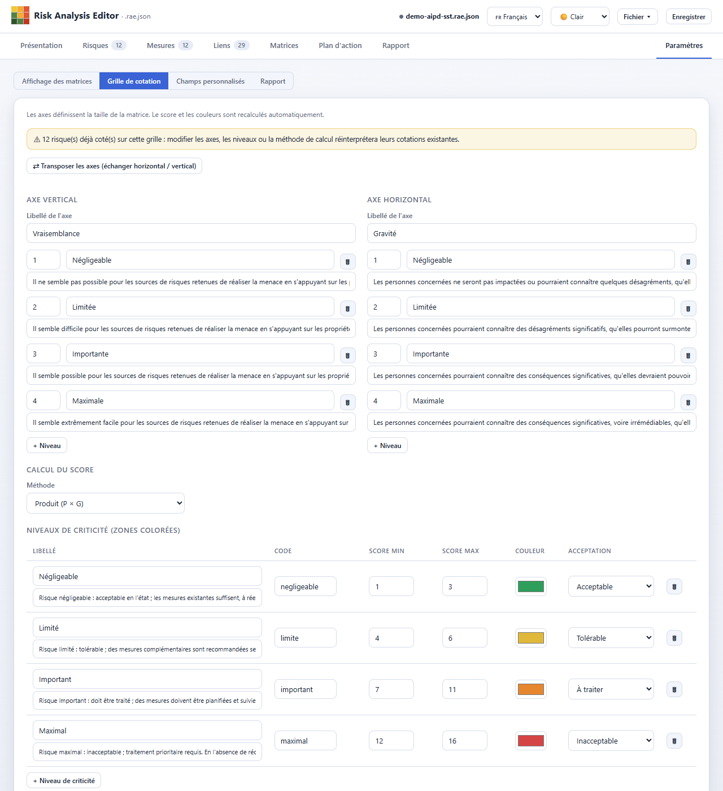

C'est le cœur de la configuration méthodologique. Vous y définissez :

- **Les deux axes** (vertical et horizontal). Dans la démo AIPD, l'axe vertical est la **Vraisemblance** et l'horizontal la **Gravité**, chacun sur 4 niveaux. Vous pouvez ajouter/retirer des niveaux (bouton *+ Niveau*), modifier leur **libellé**, leur **valeur** et une **description** affichée en infobulle. La taille de la matrice découle du nombre de niveaux.
- **La méthode de calcul du score :**
  - **Produit (P × G)** — le score est le produit vraisemblance × gravité ;
  - **Somme (P + G)** ;
  - **Matrice (niveau défini case par case)** — un éditeur dédié vous laisse fixer la valeur de chaque cellule, pour reproduire une échelle qui n'est ni un produit ni une somme.
- **Les niveaux de criticité** — les zones colorées : libellé, code, **score minimum/maximum**, **couleur**, **décision d'acceptation** et description. Un **contrôle de couverture** signale si certains scores atteignables ne tombent dans aucune zone.
- **La transposition des axes** (bouton *⇄ Transposer*) échange vertical et horizontal en un clic, cotations et placements compris.

> ⚠️ **Attention lorsque l'analyse est déjà cotée.** Si des risques sont déjà notés, un bandeau d'avertissement rappelle que modifier les axes, les niveaux ou la méthode de calcul **réinterprétera les cotations existantes** (un même couple vraisemblance/gravité peut changer de signification). Réglez de préférence la grille **avant** de saisir les risques.

### Affichage des matrices

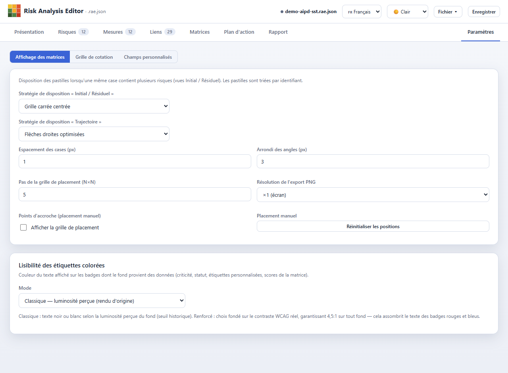

Ce sous-onglet règle le rendu visuel :

- **Stratégie de disposition** des pastilles quand plusieurs risques tombent dans la même case (vues Initial/Résiduel et Trajectoire — voir §9) ;
- **Espacement** des cases, **arrondi** des angles, **pas** de la grille de placement manuel (N×N) ;
- **Résolution de l'export PNG** (×1, ×2, ×3) ;
- affichage de la **grille d'accroche** pour le placement manuel, et bouton de **réinitialisation des positions** ;
- **Lisibilité des étiquettes colorées** : mode *Classique* (luminosité perçue) ou *Contraste renforcé (WCAG AA)*, qui calcule une couleur de texte garantissant un contraste suffisant sur n'importe quel fond.

Les champs personnalisés sont traités en [section 12](#12-les-champs-personnalisés).

---

## 5. Décrire l'analyse (onglet Présentation)

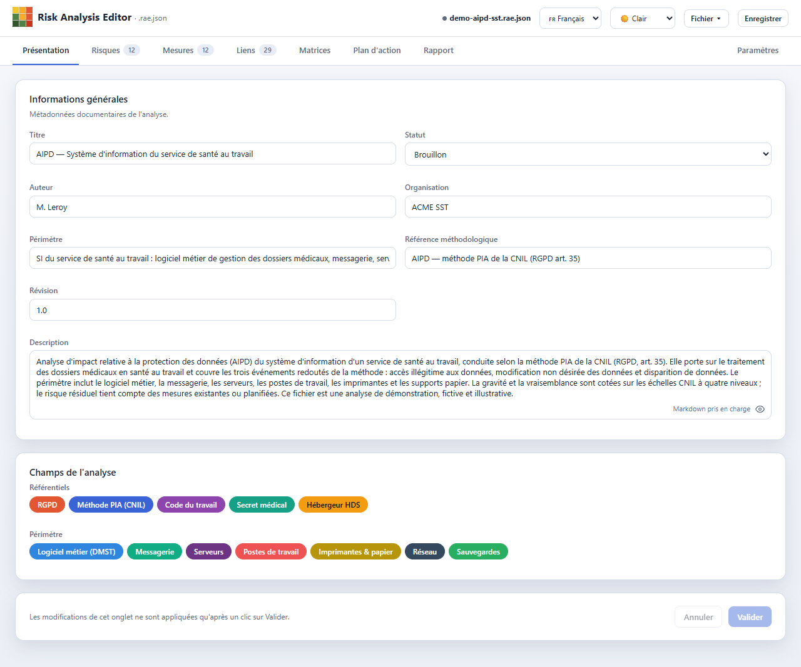

L'onglet **Présentation** rassemble les **métadonnées documentaires** de l'analyse : titre, statut (*Brouillon / Validé / Archivé*), auteur, organisation, périmètre, référence méthodologique, révision et **description** (en Markdown). Ces informations alimentent le cartouche du rapport et des exports.

Si des **champs personnalisés rattachés à l'analyse** ont été définis (dans la démo : *Référentiels*, *Périmètre*), leurs valeurs se saisissent également ici, dans un bloc dédié.

> **Particularité de cet onglet :** les saisies ne sont appliquées qu'après un clic sur **Valider** (bouton local en bas de l'onglet), afin de ne pas marquer l'analyse comme « modifiée » à chaque frappe sur une métadonnée. Le bouton *Annuler* rétablit les valeurs précédentes.

---

## 6. Le registre des risques

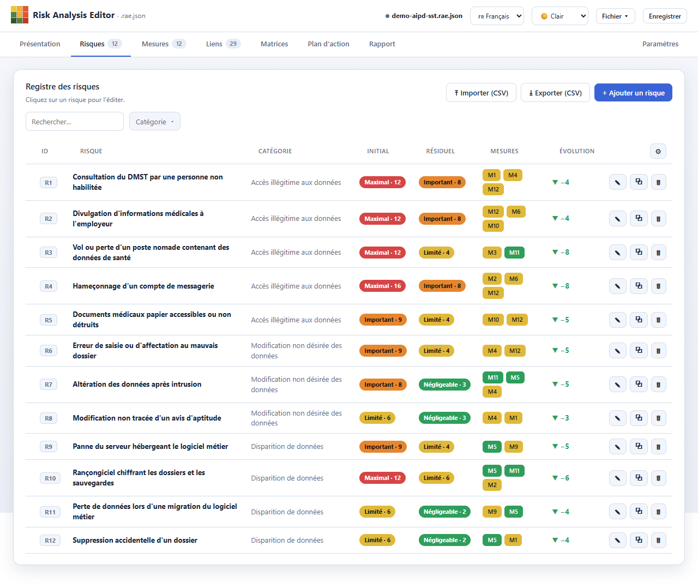

L'onglet **Risques** liste tous les risques de l'analyse. Chaque ligne montre :

- l'**ID** (identifiant, par ex. `R1`) ;
- le **libellé** du risque ;
- la **catégorie** ;
- la cotation **Initial** et **Résiduel** sous forme de pastilles colorées « niveau · score » ;
- les **mesures** qui le traitent (pastilles `M…` cliquables — voir plus bas) ;
- l'**évolution** entre initial et résiduel (▼ réduction, ▲ aggravation, ou « non réduit »).

### Créer ou modifier un risque

Cliquez sur une ligne (ou sur l'icône ✎) pour ouvrir la **fiche du risque**.

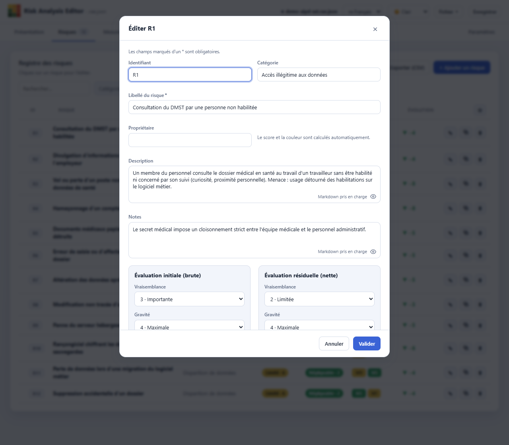

La fiche regroupe :

- **Identifiant**, **catégorie**, **libellé** (obligatoire), **propriétaire** ;
- **Description** et **Notes**, tous deux en **Markdown** (un aperçu est disponible via l'icône œil) ;
- l'**évaluation initiale (brute)** et l'**évaluation résiduelle (nette)** : vraisemblance, gravité, **justification** et date. Le score et la criticité sont **calculés et affichés automatiquement** sous chaque bloc ;
- la section **Mesures de maîtrise liées** (à cocher) ;
- les **champs personnalisés** de risque, le cas échéant.

Le bouton principal est **Créer** (nouvelle fiche) ou **Valider** (modification). À la création, un bouton **Enregistrer et nouveau** permet d'enchaîner les saisies sans rouvrir la fiche à chaque fois.

### Dupliquer, supprimer, réordonner

Chaque ligne offre trois actions :

- **✎ Modifier** ;
- **⧉ Dupliquer** — ouvre une **fiche de création pré-remplie** (identifiant suivant, libellé suffixé « (copie) », mesures associées reprises). La copie n'est créée **qu'à la validation** ;
- **🗑 Supprimer** — après confirmation. Un message **« Annuler »** apparaît alors quelques secondes pour **restaurer** la fiche supprimée (liens compris) en cas d'erreur.

**Réordonner les lignes.** Lorsqu'aucun tri de colonne n'est actif, une **poignée ⠿** apparaît au survol dans la colonne ID : glissez-la pour changer l'ordre des risques dans le fichier (au clavier : `Ctrl+↑`/`Ctrl+↓`). Cet ordre gouverne l'affichage par défaut, le rapport et les exports. Voir [§13](#13-rechercher-trier-filtrer-personnaliser-les-colonnes).

---

## 7. Les mesures de maîtrise

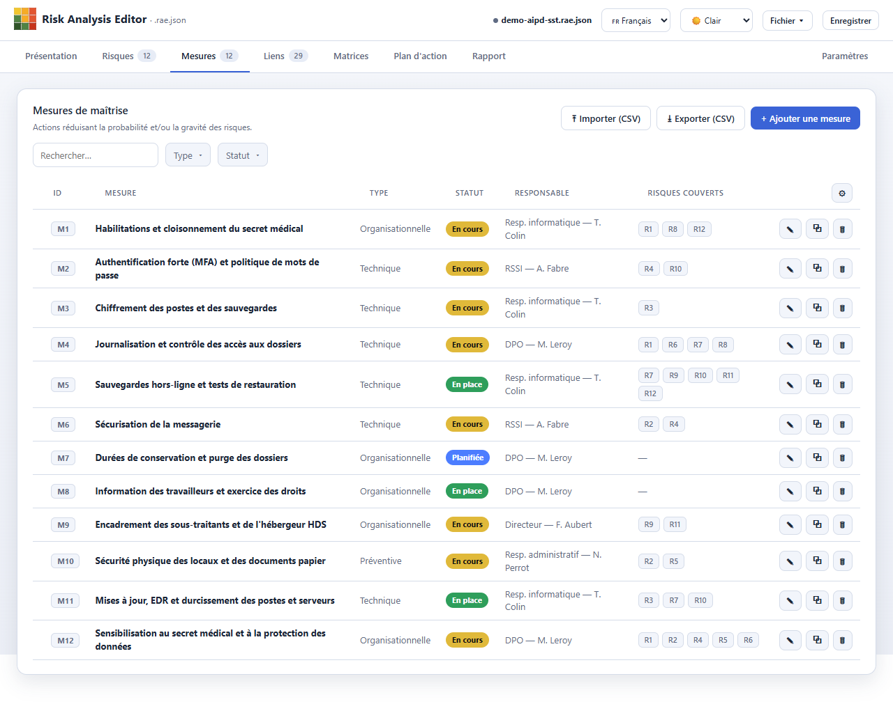

L'onglet **Mesures** liste les actions qui réduisent la probabilité et/ou la gravité des risques. Chaque mesure porte : un **type** (technique, organisationnelle, préventive…), un **statut** à code couleur (*Proposée, Planifiée, En cours, En place, Abandonnée*), un **responsable**, une **échéance**, un **coût**, et les **risques couverts**.

Le fonctionnement du registre est identique à celui des risques : recherche, tri, filtres, colonnes personnalisables, duplication (⧉), suppression avec annulation, et réordonnancement par poignée.

### Fiche d'une mesure

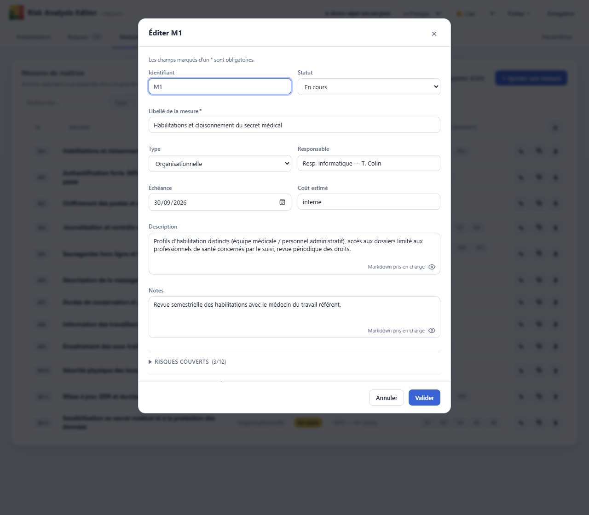

La fiche permet de renseigner le libellé, le type, le statut, le responsable, l'échéance, le coût, une description et des notes (Markdown), les **risques couverts** (à cocher), et les **champs personnalisés** de mesure (dans la démo : *Avancement* en barre de progression, *Nature*, *Objectif*).

---

## 8. Les liens risques ↔ mesures

L'onglet **Liens** matérialise le fait qu'une mesure traite un ou plusieurs risques (relation plusieurs-à-plusieurs). Il comporte deux sous-onglets.

### Associations

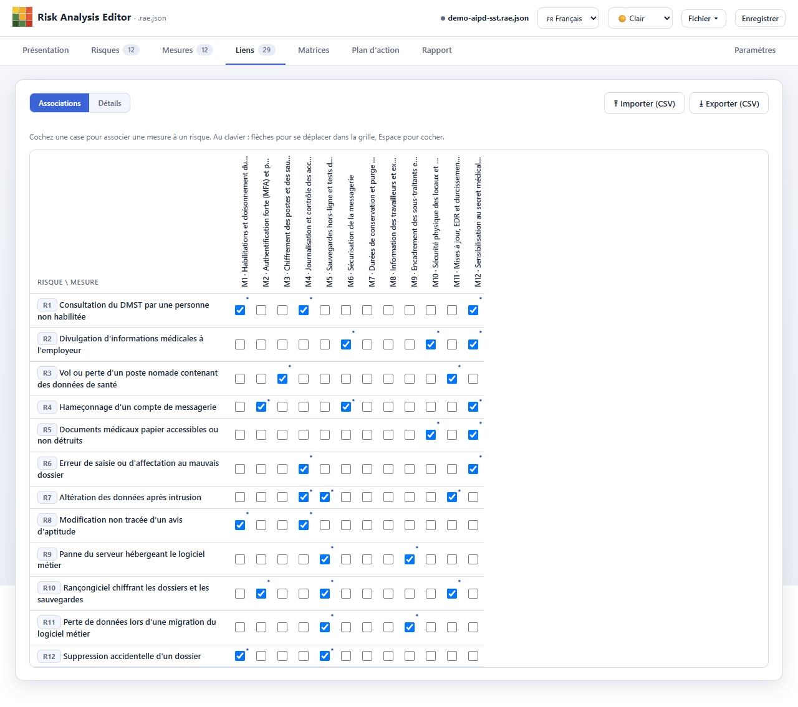

Un **tableau croisé** risques × mesures : cochez une case pour associer une mesure à un risque. Une confirmation est demandée à chaque coche ; en phase d'association massive, vous pouvez cocher **« Ne plus demander (pour cette session) »** dans la boîte de confirmation. Les liens **enrichis** (porteurs d'une note ou de champs personnalisés) sont signalés dans le tableau.

Au clavier : les flèches déplacent le curseur dans la grille, `Espace` coche/décoche.

### Détails

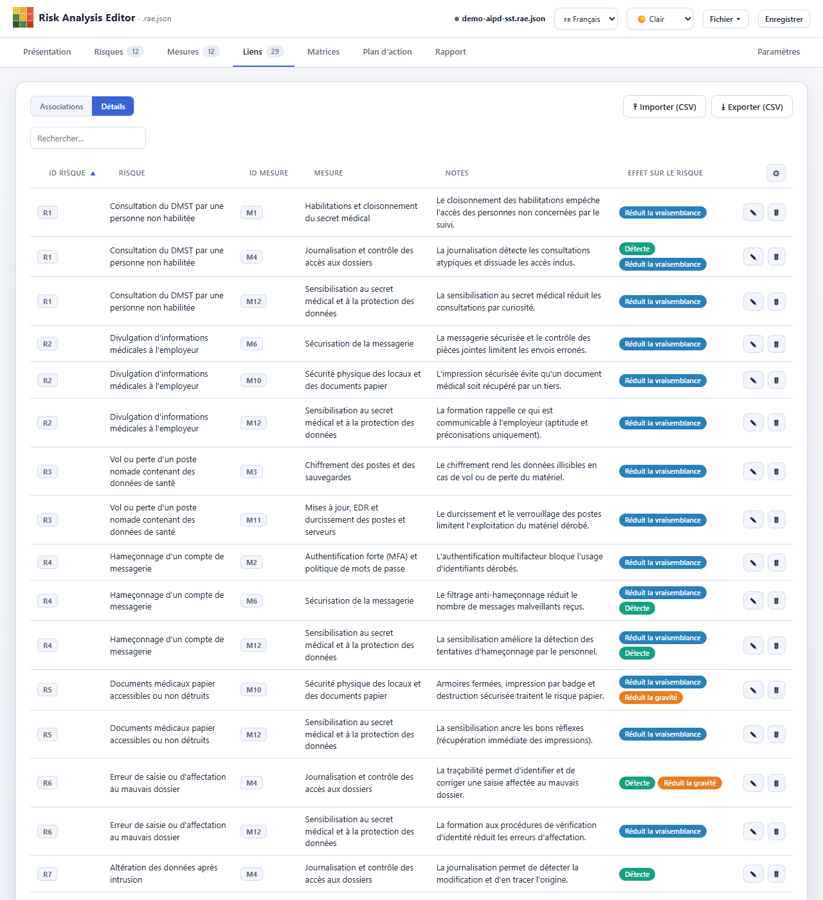

Un **registre éditable** des liens existants, où chaque lien porte une **note** (justification « pourquoi cette mesure agit sur ce risque ») et ses propres **champs personnalisés** de lien (dans la démo : *Effet attendu*). Comme les autres registres, il est triable, filtrable et ses colonnes sont personnalisables.

Cliquez sur une ligne pour ouvrir la **fiche du lien** :

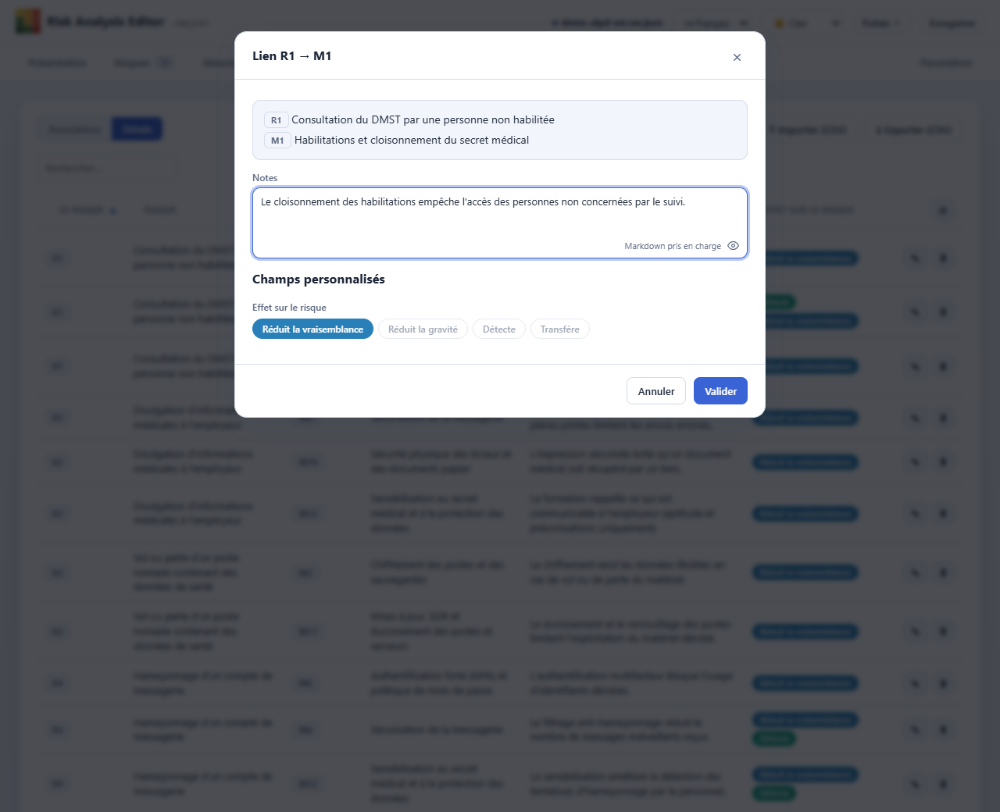

---

## 9. Les matrices

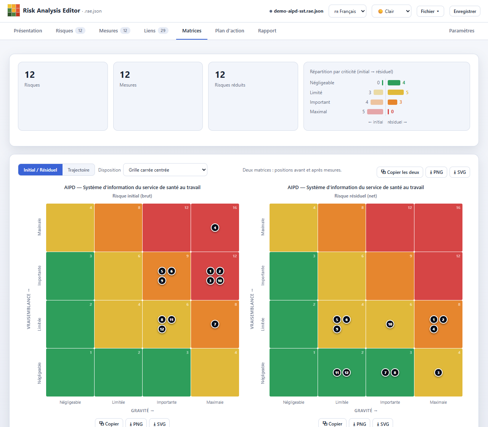

L'onglet **Matrices** est le point fort visuel de l'outil. En haut, un bandeau de **statistiques** : nombre de risques, de mesures, de risques réduits, et la **répartition par criticité** (initial → résiduel).

Deux vues, sélectionnables par la bascule en haut à gauche :

- **Initial / Résiduel** — deux matrices côte à côte : les positions **avant** et **après** mesures. Chaque risque est une **pastille** placée dans la case (vraisemblance × gravité) correspondant à sa cotation.
- **Trajectoire** — une seule matrice où une **flèche** relie la position initiale (contour pointillé) à la position résiduelle (contour plein) de chaque risque. Les risques **non réduits** sont mis en évidence.

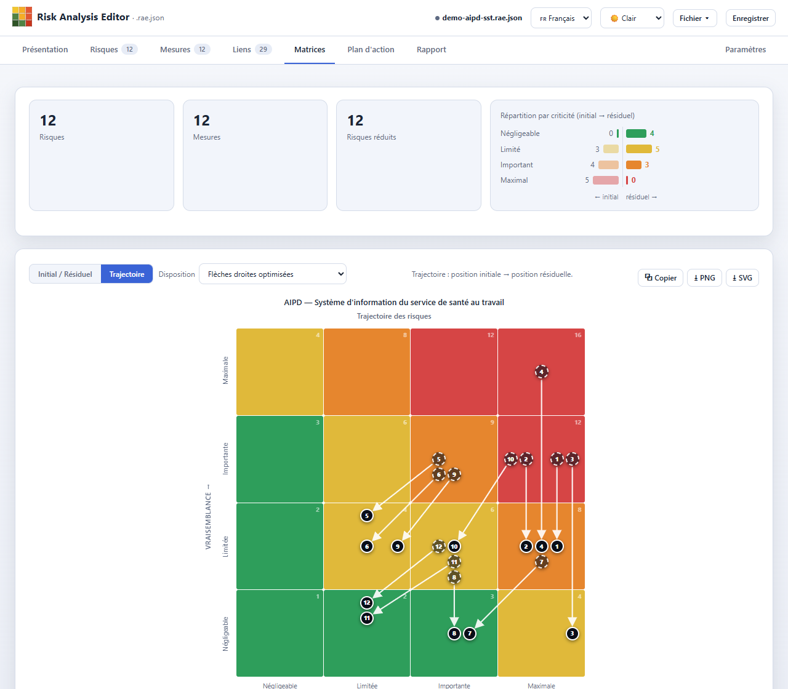

Autres commandes :

- **Disposition** — comment répartir plusieurs pastilles dans une même case (grille carrée centrée, rangée, colonne, amas/spirale, débordement « +N »…). En vue Trajectoire, une disposition « flèches droites optimisées » minimise les croisements. La disposition **Manuel** ajoute en plus un **placement fin** des pastilles à l'intérieur de leur case au glisser-déposer (avec grille d'accroche) ; ces positions sont enregistrées dans le fichier.
- **Copier**, **PNG**, **SVG** — exportent les matrices comme image (copie dans le presse-papiers, PNG en ×1/×2/×3, ou SVG vectoriel), avec titre, axes et légende.

> **Recoter au glisser-déposer.** Dans **toutes les matrices** (Initial, Résiduel, Trajectoire) et **quelle que soit la disposition**, vous pouvez **faire glisser une pastille vers une autre case** : la **cotation** du risque est mise à jour en conséquence — sa **vraisemblance (P)** et sa **gravité (G)** prennent les valeurs de la case d'arrivée, et un message confirme la nouvelle cotation. Dans la vue Initial/Résiduel, déplacer la pastille de gauche modifie la cotation **initiale**, celle de droite la cotation **résiduelle** ; en Trajectoire, le déplacement ajuste la position **résiduelle**. Au clavier, `Ctrl` + les flèches déplacent la pastille sélectionnée de case en case.

> Les pastilles portent un numéro. Lorsque tous les identifiants sont au format `R…` (comme dans la démo), c'est le numéro de l'identifiant ; sinon les risques sont numérotés selon leur ordre dans le fichier. Le survol d'une pastille affiche l'identifiant complet, le libellé et la cotation.

---

## 10. Le plan d'action

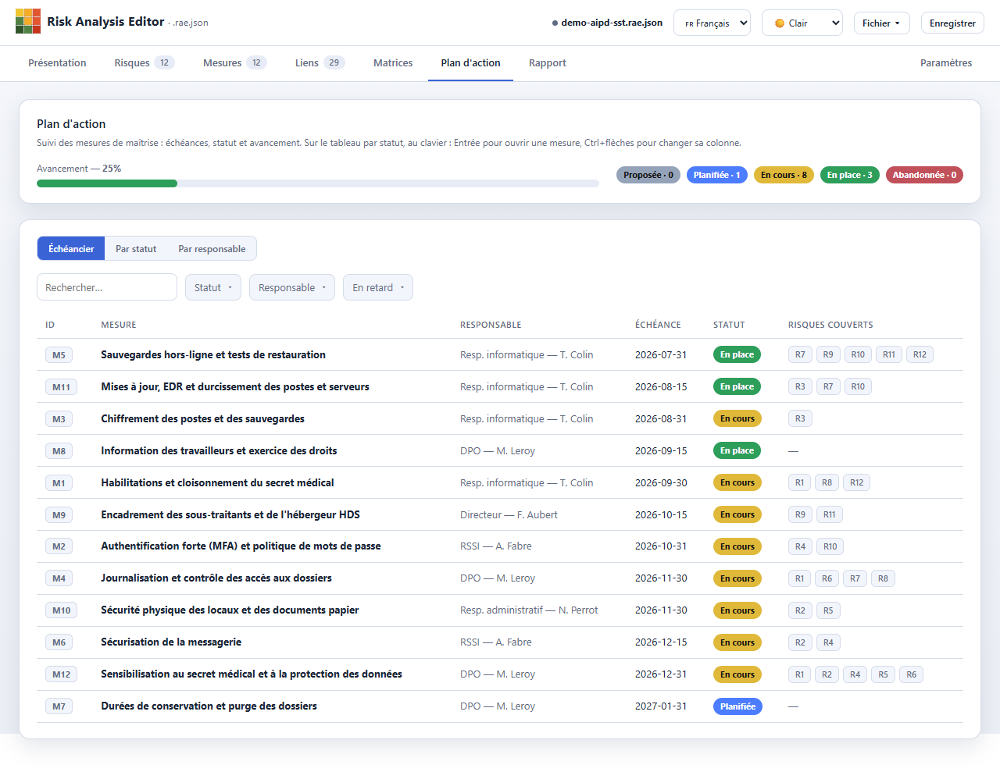

L'onglet **Plan d'action** transforme les mesures en suivi opérationnel, à travers trois présentations (bascule en haut) :

- **Échéancier** — la liste des mesures triée par date d'échéance ;
- **Par statut** — un **kanban** : chaque mesure est une carte dans la colonne de son statut, que l'on **glisse-dépose** d'une colonne à l'autre (au clavier : `Ctrl+flèches`) ;
- **Par responsable** — les mesures regroupées par personne responsable.

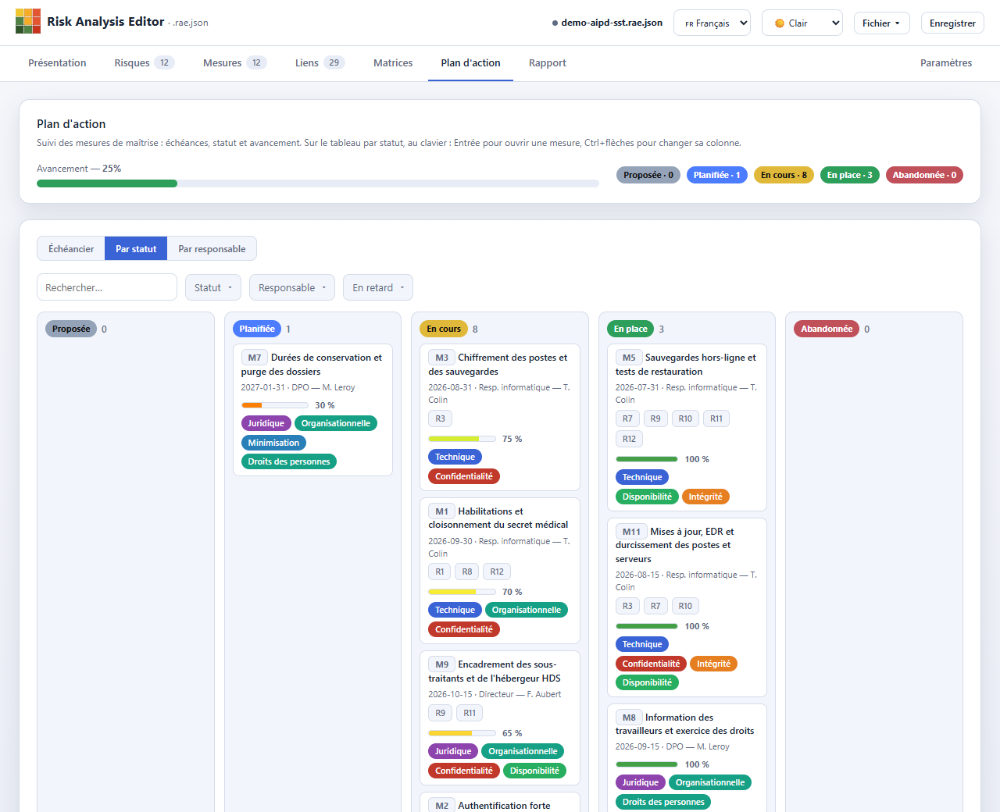

Un bloc de **synthèse** affiche l'avancement global (barre + compteurs par statut). Les mesures **en retard** (échéance passée et non finalisées) sont mises en évidence. Chaque carte est **éditable au clic** (elle ouvre la fiche de la mesure).

---

## 11. Le rapport

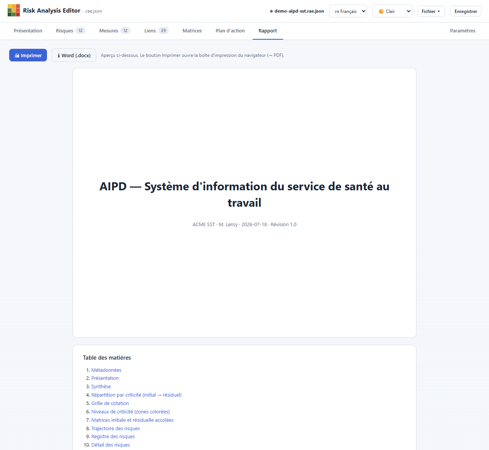

L'onglet **Rapport** génère un document complet, prêt à imprimer. Par défaut, il comporte une **page de garde**, une **table des matières**, puis : le cartouche (métadonnées), un bloc **Présentation** (description et champs de l'analyse), la **synthèse** (compteurs et répartition par criticité), la **grille de cotation** détaillée, les **matrices**, le **registre des risques** et le **détail** des risques, les **mesures**, les **liens** et le **plan d'action**.

Le bouton **🖨 Imprimer** ouvre la boîte d'impression du navigateur : choisissez « Enregistrer au format PDF » pour produire un PDF. Le bouton **⭳ Word (.docx)** exporte le même rapport en document Word éditable (voir §15).

### Personnaliser le rapport (Paramètres › Rapport)

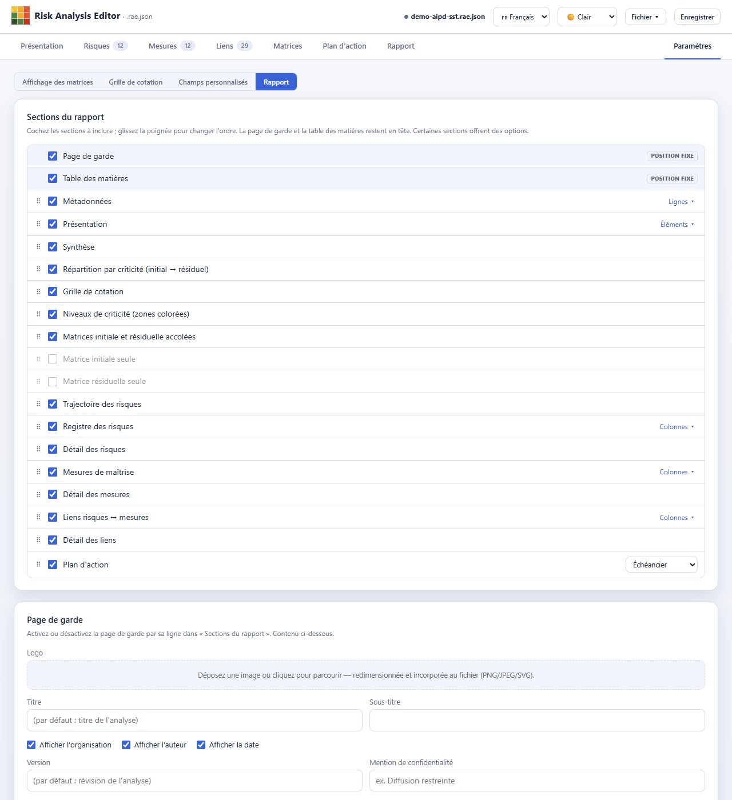

Le sous-onglet **Paramètres › Rapport** permet d'adapter finement le contenu et la mise en forme du rapport. Les préférences sont **enregistrées dans le fichier** `.rae.json` et pilotent à la fois l'aperçu à l'écran, l'impression PDF et l'export Word.

- **Sections & ordre** — cochez les sections à inclure et **glissez la poignée ⠿** pour les réordonner. La page de garde et la table des matières restent en tête.
- **Page de garde** — logo (déposé ou parcouru, redimensionné et incorporé au fichier), titre, sous-titre, affichage de l'organisation / auteur / date, version, mention de confidentialité et texte libre (Markdown).
- **Table des matières** — activable ; rendue en table des matières **native** (mise à jour à l'ouverture) dans l'export Word.
- **En-tête / pied de page** — trois zones (gauche, centre, droite) avec des **variables** insérables (`{title}`, `{organization}`, `{author}`, `{date}`, `{version}`, `{confidentiality}`, `{page}`, `{pages}`). ⚠️ **Réservé à l'export Word** : l'en-tête et le pied de page n'apparaissent pas à l'écran ni à l'impression PDF.
- **Colonnes des tableaux** — pour chaque registre (risques, mesures, liens), choisissez les colonnes et leur ordre (champs personnalisés compris) ; de même pour les **lignes du cartouche** de métadonnées et les **éléments de la Présentation**.
- **Matrices** — trois sections indépendantes : *initiale et résiduelle accolées* (cochée par défaut), *initiale seule*, *résiduelle seule*.
- **Plan d'action** — présentation au choix : échéancier, par statut ou par responsable.
- **Orientation** — portrait (par défaut) ou paysage.
- **Périmètre** — *analyse complète* ou *sous-ensemble filtré* (selon les filtres actifs). En mode filtré, une section **« Périmètre filtré »** récapitule les filtres appliqués et le nombre d'éléments retenus.

Le bouton **↺ Réinitialiser le rapport par défaut** efface la personnalisation et rétablit le modèle par défaut.

---

## 12. Les champs personnalisés

Les **champs personnalisés** étendent le modèle de données pour l'adapter à votre méthode. Ils se définissent dans *Paramètres › Champs personnalisés*.

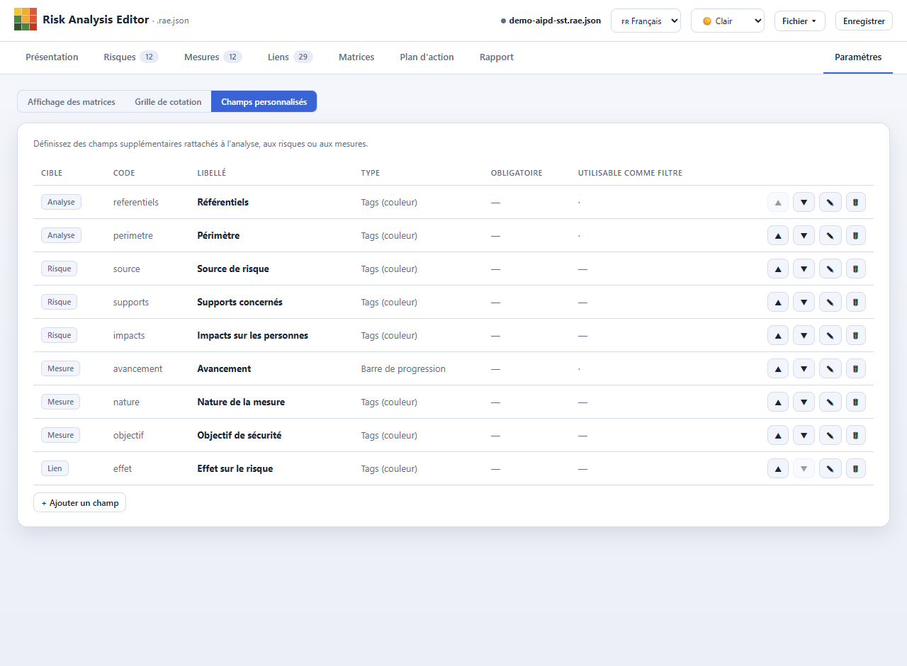

Chaque champ possède :

- une **cible** — à quel objet il se rattache : *analyse*, *risque*, *mesure* ou *lien* ;
- un **code** (identifiant technique) et un **libellé** (multilingue) ;
- un **type** parmi dix : oui/non, entier, décimal, date, texte, texte long, liste déroulante, liste à cocher, **tags colorés** (choix unique ou multiple) et **barre de progression** (0–100 %) ;
- des attributs optionnels : **obligatoire**, bornes (min/max, longueur, nombre d'items), une **aide** et une **description** ;
- l'option **Utilisable comme filtre** (pour les types à valeurs fermées rattachés à un risque, une mesure ou un lien — voir §13).

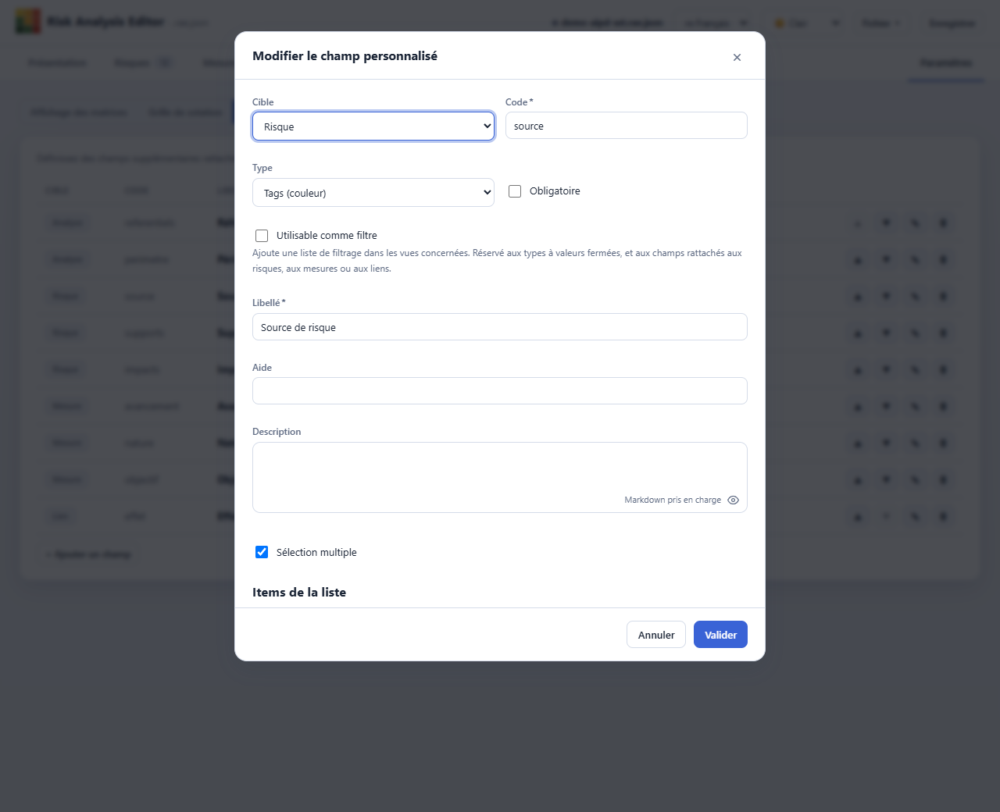

Les **valeurs** des champs se saisissent ensuite dans les fiches (risque, mesure, lien) et, pour les champs d'analyse, dans l'onglet *Présentation*. Elles sont reprises dans le **rapport**, l'**import/export CSV** et les **exports Word/Excel**, et peuvent devenir des **colonnes** dans les registres.

> Les libellés et l'aide se saisissent dans la langue de l'interface active ; à défaut de traduction, le code du champ est affiché.

> ⚠️ **Champ déjà utilisé.** Si vous **supprimez** un champ qui contient déjà des valeurs, si vous **changez sa cible** (par ex. de *risque* à *mesure*) ou si vous **changez son type** de façon incompatible (par ex. de *tags* à *texte*), l'outil indique combien de valeurs sont concernées et avertit qu'elles deviendront inaccessibles ou inexploitables, avant d'appliquer.

---

## 13. Rechercher, trier, filtrer, personnaliser les colonnes

Ces fonctions transversales s'appliquent aux registres Risques, Mesures et au détail des Liens.

- **Rechercher.** Le champ *Rechercher…* filtre les lignes par texte libre.
- **Trier.** Un clic sur un en-tête de colonne trie ; l'en-tête cycle sur **trois états** : croissant → décroissant → **retour à l'ordre d'origine** (l'ordre du fichier). Les colonnes de champ personnalisé scalaires sont également triables.
- **Filtrer.** Des filtres déroulants (catégorie, type, statut, responsable, « en retard uniquement », et tout champ personnalisé déclaré *filtrable*) restreignent l'affichage. Les filtres se **combinent (ET)**. Ceux de **catégorie** (risque), **type** et **statut** (mesure) ainsi que les **champs personnalisés** se **propagent le long des liens** — et donc à **tous les onglets, aux matrices et au rapport** : filtrer sur un risque restreint aussi les mesures et les liens correspondants, et réciproquement. La **recherche texte** et les filtres propres au *Plan d'action* (**responsable**, **« en retard »**) restent **locaux** à leur vue. Un compteur « n sur N » et un bouton *Réinitialiser* apparaissent dès qu'un filtre ou une recherche restreint la vue (la réinitialisation efface aussi les filtres propagés). Le filtrage courant est reflété dans l'**adresse (URL)**, ce qui permet de partager une vue filtrée.
- **Personnaliser les colonnes.** Le bouton **⚙** à droite de l'en-tête ouvre le menu des colonnes.

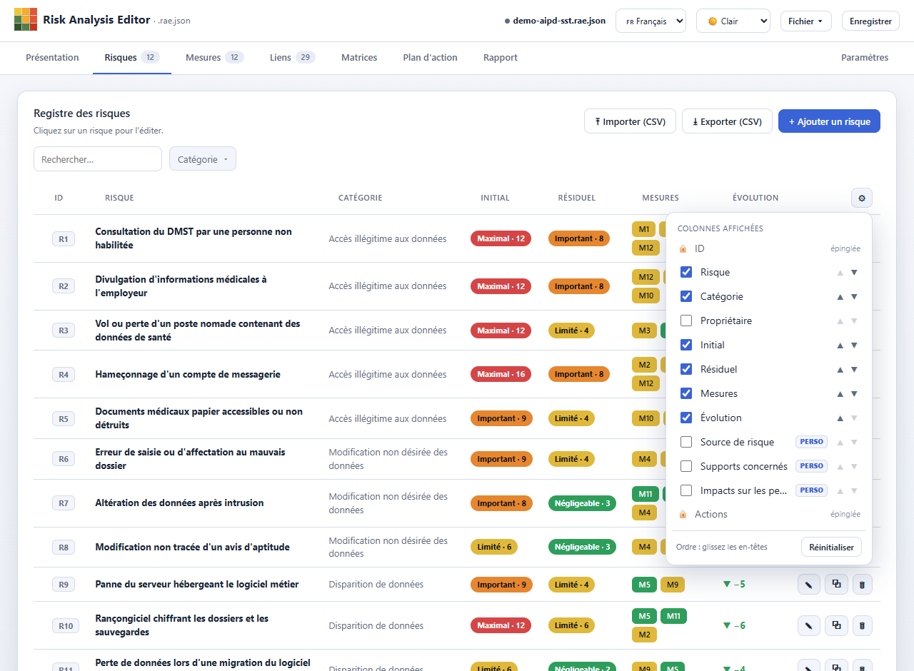

Vous pouvez y **afficher/masquer** chaque colonne (y compris les champs personnalisés, marqués *perso*), et les **réordonner** — soit par les flèches ▲/▼ du menu, soit en **glissant directement les en-têtes** dans le tableau. Les colonnes **ID** et **Actions** restent épinglées. La disposition est **enregistrée dans le fichier**.

---

## 14. Import et export CSV

Chaque registre (Risques, Mesures, Liens) propose **Importer (CSV)** et **Exporter (CSV)**.

- **Export.** Les en-têtes sont les **clés anglaises** du format (identiques quelle que soit la langue de l'interface), avec délimiteur `;` et BOM UTF-8 pour Excel. Des colonnes dérivées en lecture seule sont ajoutées (score/criticité pour les risques ; risques couverts pour les mesures ; libellés pour les liens). Le fichier est **ré-importable**.
- **Import.** Les colonnes sont nommées d'après ces mêmes clés anglaises ; le séparateur est auto-détecté. Les risques et mesures sont **fusionnés par identifiant** ; les liens font l'objet d'un contrôle d'intégrité et d'une déduplication.

Le CSV est idéal pour préparer ou retravailler les données dans un tableur, puis les réinjecter.

---

## 15. Exports Word et Excel

Le menu **Fichier** propose deux exports bureautiques, générés **localement et hors-ligne** (aucune donnée n'est envoyée sur Internet) :

- **Exporter en Word (.docx)** — suit la **même configuration** que le rapport (voir [§11](#11-le-rapport) : sections, ordre, colonnes, périmètre, orientation) et y ajoute une **page de garde**, une **table des matières** et un **en-tête / pied de page natifs** (avec numéros de page). Cartouche, présentation, synthèse, grille, **matrices en images**, registres et fiches détaillées. Prêt à fondre dans un gabarit d'entreprise. Également accessible via le bouton *⭳ Word* de l'onglet Rapport.
- **Exporter en Excel (.xlsx)** — un classeur à quatre feuilles (**Synthèse / Risques / Mesures / Liens**), avec cellules typées (vraies dates et nombres), couleurs de criticité et de statut, en-têtes figés et filtres automatiques.

---

## 16. Gérer les fichiers et les modèles

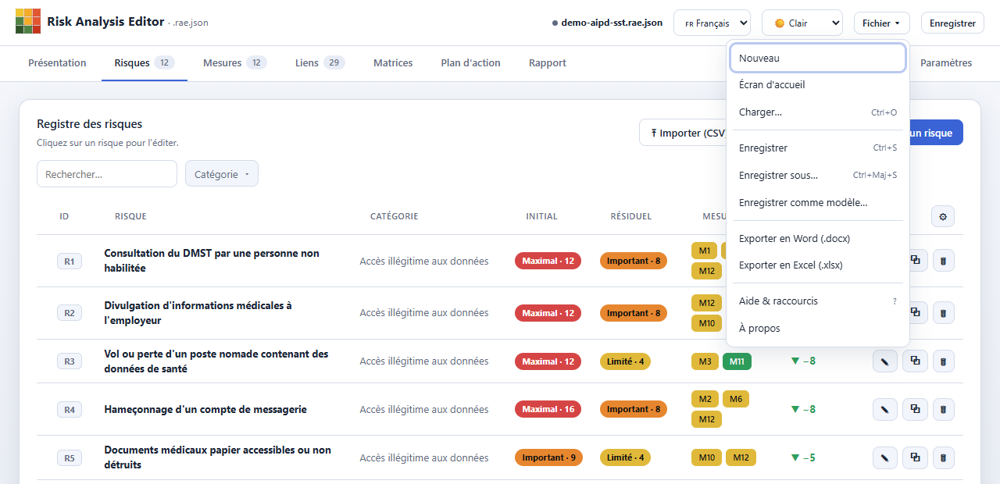

Le menu **Fichier** rassemble :

- **Nouveau** — repart d'une analyse vierge (avec confirmation si des modifications sont en cours) ;
- **Écran d'accueil** — revient au bloc d'amorçage ;
- **Charger…** (`Ctrl+O`) — ouvre un fichier `.rae.json`. Vous pouvez aussi **glisser-déposer** un fichier `.rae.json` sur la fenêtre ;
- **Enregistrer** (`Ctrl+S`) et **Enregistrer sous…** (`Ctrl+Maj+S`) ;
- **Enregistrer comme modèle…** — exporte un squelette (grille + champs personnalisés, sans risques ni mesures) réutilisable comme point de départ ;
- **Exporter en Word / Excel** (voir §15) ;
- **À propos** (version de l'application) et **Aide & raccourcis**.

**Modèles méthodologiques.** L'écran d'accueil propose de démarrer d'un modèle (EBIOS RM, AIPD — CNIL PIA, ISO 27005, générique). Ouvrir un modèle démarre une **nouvelle analyse non reliée** : votre travail ne remplace jamais le modèle.

**Chargement par l'adresse.** Servi en HTTP(S), l'outil accepte des paramètres d'URL : `?file=…` (charger une analyse), `?lang=fr|en|it`, `?tab=<onglet>[.<sous-onglet>]`, `?filter=code:valeur;…`. Exemple : `…?tab=matrices.traj` ouvre directement la vue Trajectoire.

---

## 17. Raccourcis clavier et accessibilité

Un panneau récapitule les gestes et raccourcis : menu **Fichier › Aide & raccourcis**, ou la touche **`?`**.

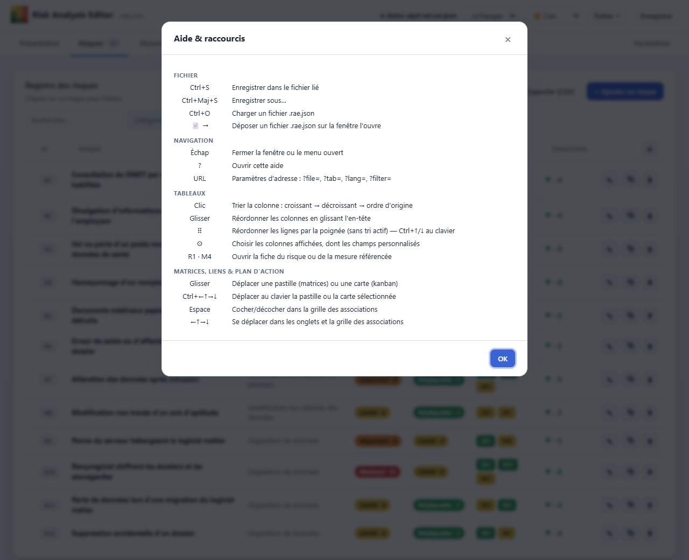

Principaux raccourcis :

| Raccourci | Action |
|---|---|
| `Ctrl+S` / `Ctrl+Maj+S` | Enregistrer / Enregistrer sous |
| `Ctrl+O` | Charger un fichier |
| `Échap` | Fermer la fenêtre ou le menu ouvert |
| `?` | Ouvrir l'aide |
| Clic sur l'en-tête | Trier (croissant → décroissant → ordre d'origine) |
| Glisser l'en-tête | Réordonner les colonnes |
| Glisser la poignée ⠿ / `Ctrl+↑`·`Ctrl+↓` | Réordonner les lignes (sans tri actif) |
| `Ctrl+flèches` | Déplacer une pastille (matrices) ou une carte (kanban) |
| Flèches / `Espace` | Se déplacer / cocher dans la grille des associations |

**Accessibilité.** L'outil est utilisable au clavier (onglets, grilles, alternatives au glisser-déposer), les boutons à icône portent des noms accessibles, le focus est visible, et un mode de **contraste renforcé (WCAG AA)** est disponible pour les étiquettes colorées (voir §4).

---

## 18. Compatibilité navigateurs

L'application fonctionne dans un navigateur de bureau récent, sans installation ni serveur. Les tests sont réalisés principalement avec **Microsoft Edge (Chromium)** ; tout navigateur basé sur Chromium offre l'expérience complète.

- **Firefox / Safari** : l'enregistrement direct dans le fichier ouvert n'est pas disponible ; *Enregistrer* se replie sur un **téléchargement** du `.rae.json` (et *Charger* sur un sélecteur de fichier classique). Tout le reste est identique.
- Le **chargement par URL** (`?file=…`) nécessite que l'outil soit servi en HTTP(S) ; en ouverture directe du fichier (`file://`), utilisez *Charger* ou le glisser-déposer.

Le détail figure dans le [README](../README.fr.md#compatibilité-navigateurs).

---

## 19. Format de fichier et interopérabilité

Une analyse est un unique fichier **`.rae.json`** (JSON lisible) contenant la grille, les risques, les mesures, les liens, les cotations et les champs personnalisés. Les **noms de propriétés sont en anglais** ; les **valeurs** (libellés, descriptions) restent dans la langue de l'analyse. Le format est **ouvert et spécifié**, ce qui permet de le produire ou de le consommer avec d'autres outils.

La spécification complète et le schéma JSON de validation se trouvent dans le dossier [`specs/`](../specs/) :

- [`specs/SPEC-format-analyse-risque.md`](../specs/SPEC-format-analyse-risque.md) — spécification détaillée ;
- [`specs/schema-analyse-risque.json`](../specs/schema-analyse-risque.json) — schéma JSON.

---

## 20. Questions fréquentes et astuces

**Où sont enregistrées mes données ?**
Uniquement dans le fichier `.rae.json` que vous enregistrez, sur votre poste. L'outil fonctionne hors-ligne et n'envoie rien sur Internet, exports Word/Excel compris.

**Comment revenir à l'ordre d'origine après avoir trié une colonne ?**
Cliquez une troisième fois sur l'en-tête : le tri cycle croissant → décroissant → **ordre d'origine**.

**J'ai supprimé un risque par erreur.**
Cliquez sur **« Annuler »** dans le message qui apparaît juste après la suppression ; la fiche et ses liens sont restaurés.

**Pourquoi ne puis-je pas réordonner les lignes ?**
Le réordonnancement par poignée n'est possible que **sans tri de colonne actif**. Ramenez le tri à l'ordre d'origine (voir ci-dessus).

**Comment adapter l'outil à ma méthode (EBIOS RM, ISO 27005…) ?**
Configurez la **grille de cotation** (§4) et créez des **champs personnalisés** (§12) pour les notions propres à votre méthode (source de risque, biens supports, événement redouté…). Vous pouvez partir d'un **modèle** fourni.

**La modification de ma grille a changé les cotations affichées.**
C'est attendu : le score et la criticité sont **recalculés** à partir de la grille. Fixez la grille avant de coter, ou tenez compte du bandeau d'avertissement.

---

*Ce guide correspond à Risk Analysis Editor version 1.8.1. Les captures illustrent l'analyse de démonstration fictive `examples/demo-aipd-sst.rae.json`.*
