 Guide utilisateur — Risk Analysis Editor (RAE)

Ce guide décrit l'utilisation complète de **Risk Analysis Editor**, l'éditeur d'analyses de risques au format ouvert `.rae.json`. Il commence par une **prise en main rapide**, puis détaille **chaque écran et chaque fonction**.

> Toutes les captures d'écran illustrent l'analyse de démonstration **« Analyse de risques (volet AIPD) — SI d'un service de santé au travail »** (fictive), livrée avec l'outil : [`examples/demo-aipd-sst.rae.json`](../examples/demo-aipd-sst.rae.json). Interface en français, thème clair. Vous pouvez l'ouvrir pour reproduire pas à pas ce qui est décrit ici.

---

## Sommaire

1. [Introduction](#1-introduction)
2. [Prise en main en quelques minutes](#2-prise-en-main-en-quelques-minutes)
3. [L'interface générale](#3-linterface-générale)
4. [Paramétrer la grille de cotation](#4-paramétrer-la-grille-de-cotation)
5. [Décrire l'analyse (onglet Présentation)](#5-décrire-lanalyse-onglet-présentation)
6. [Le registre des risques](#6-le-registre-des-risques)
7. [Les mesures de maîtrise](#7-les-mesures-de-maîtrise)
8. [Les liens risques ↔ mesures](#8-les-liens-risques--mesures)
9. [Les matrices](#9-les-matrices)
10. [Les radars](#10-les-radars)
11. [Les statistiques](#11-les-statistiques)
12. [Le plan d'action](#12-le-plan-daction)
13. [Le rapport](#13-le-rapport)
14. [Les champs personnalisés](#14-les-champs-personnalisés)
15. [Les objets et les références](#15-les-objets-et-les-références)
16. [Rechercher, trier, filtrer, personnaliser les colonnes](#16-rechercher-trier-filtrer-personnaliser-les-colonnes)
17. [Import et export CSV](#17-import-et-export-csv)
18. [Exports Word et Excel](#18-exports-word-et-excel)
19. [Gérer les fichiers et les modèles](#19-gérer-les-fichiers-et-les-modèles)
20. [Raccourcis clavier et accessibilité](#20-raccourcis-clavier-et-accessibilité)
21. [Compatibilité navigateurs](#21-compatibilité-navigateurs)
22. [Format de fichier et interopérabilité](#22-format-de-fichier-et-interopérabilité)
23. [Questions fréquentes et astuces](#23-questions-fréquentes-et-astuces)

---

## 1. Introduction

**Risk Analysis Editor** est une application web **autonome** : un unique fichier HTML, sans dépendance réseau ni service externe, qui fonctionne **hors-ligne**. Un simple double-clic sur le fichier l'ouvre dans votre navigateur.

Elle permet de mener une analyse de risque complète :

- définir une **grille de cotation** (axes, niveaux, méthode de calcul du score, zones de criticité) ;
- saisir des **risques**, les **coter** avant et après traitement (risque **initial/brut** → risque **résiduel/net**) ;
- décrire des **mesures de maîtrise** et les **relier** aux risques ;
- **visualiser** le résultat sous forme de matrices et de trajectoires, **suivre** le plan d'action et **produire** un rapport.

L'outil est **indépendant de toute méthodologie** : il fournit les briques génériques (grille configurable, registres, liens, champs personnalisés) qui permettent de construire une analyse **EBIOS RM**, **AIPD (CNIL PIA)**, **ISO 27005** ou selon un référentiel interne. Toute l'analyse tient dans un fichier `.rae.json` autoportant, que vous pouvez enregistrer, partager et rouvrir.

**Public visé :** responsables des risques, RSSI, analystes sécurité, DPO, consultants GRC — aucune compétence technique n'est requise.

---

## 2. Prise en main en quelques minutes

À l'ouverture, tant qu'aucune analyse n'est chargée, l'application affiche un **écran d'accueil** qui résume le parcours.

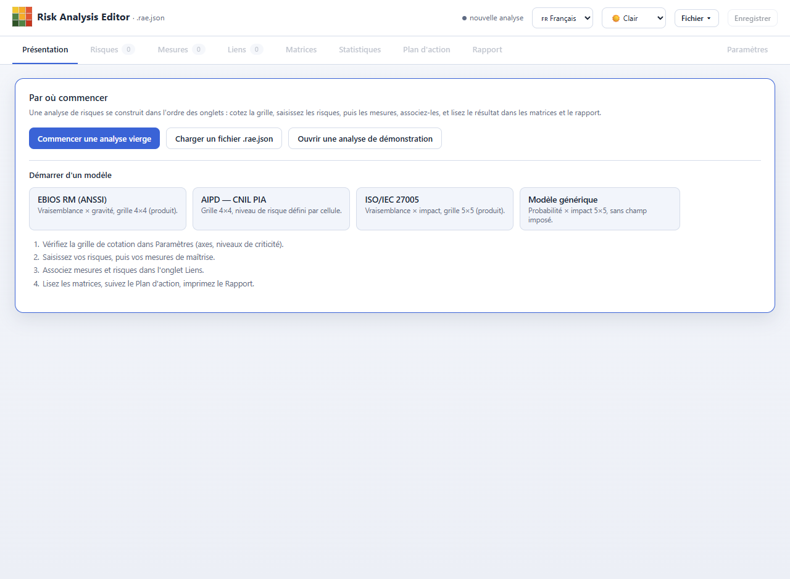

Vous avez quatre points de départ :

- **Commencer une analyse vierge** — une grille par défaut, à personnaliser ;
- **Charger un fichier .rae.json** — reprendre une analyse existante ;
- **Ouvrir une analyse de démonstration** — un exemple renseigné pour explorer ;
- **Démarrer d'un modèle** — un squelette méthodologique préconfiguré (EBIOS RM, AIPD — CNIL PIA, ISO/IEC 27005, ou générique).

> La **démonstration** nécessite d'utiliser l'application **en ligne** (ou servie via HTTP) ; en ouverture directe du fichier (double-clic, `file://`), ce bouton n'apparaît pas — démarrez alors d'un **modèle** ou chargez un fichier existant. Les **modèles**, eux, restent disponibles dans tous les cas, y compris hors-ligne.

Le parcours conseillé se lit dans l'ordre des onglets :

1. **Vérifiez la grille de cotation** dans *Paramètres* (axes, niveaux de criticité).
2. **Saisissez vos risques**, puis vos **mesures** de maîtrise.
3. **Associez** mesures et risques dans l'onglet *Liens*.
4. **Lisez les matrices**, suivez le *Plan d'action*, imprimez le *Rapport*.

Chaque étape est détaillée dans les sections suivantes.

En bas de l'écran d'accueil, une liste **Fichiers récents** rassemble les dernières analyses **ouvertes ou enregistrées**, avec le **nom du fichier** et le **nom de l'analyse**. Le **bouton d'ouverture** (ou un clic sur la ligne) rouvre le fichier — le navigateur demande alors l'**autorisation** d'y accéder ; le **×** retire une entrée et **Effacer la liste** vide l'ensemble. Cette liste nécessite un navigateur compatible (Chrome, Edge) et **n'apparaît pas** ailleurs.

---

## 3. L'interface générale

### La barre supérieure

En haut de la fenêtre :

- le **logo** et le nom de l'application ;
- l'**état du document** au centre : le nom du fichier lié (par ex. `demo-aipd-sst.rae.json`) et une pastille **« modifié »** dès qu'une modification n'est pas enregistrée ;
- le sélecteur de **langue** de l'interface (Français / English / Italiano) ;
- le sélecteur de **thème** (Clair / Sombre) ;
- le menu **Fichier** (voir §19) ;
- le bouton **Enregistrer**, qui écrit les modifications dans le fichier `.rae.json`.

### Les onglets

La navigation se fait par onglets : **Présentation**, **Risques**, **Mesures**, **Liens**, **Objets**, **Matrices**, **Radars**, **Statistiques**, **Plan d'action**, **Rapport**, et **Paramètres** (à droite). Les onglets Risques, Mesures, Liens et Objets affichent un **compteur** du nombre d'éléments.

### Enregistrement et sécurité des données

- **Enregistrement.** Le bouton *Enregistrer* (ou `Ctrl+S`) écrit dans le fichier. Selon le navigateur, il écrit directement dans le fichier ouvert, ou propose un téléchargement (voir §21).
- **Sauvegarde automatique.** L'outil conserve en arrière-plan une copie de travail : si vous fermez l'onglet par accident, il vous **propose de restaurer** l'analyse non enregistrée à la réouverture.
- **Garde anti-perte de saisie.** Si vous fermez une fiche en cours d'édition par un clic à côté, la touche `Échap` ou la croix ✕ alors que vous avez commencé à saisir, l'outil demande **confirmation** avant d'abandonner vos modifications. Le bouton *Annuler* de la fiche, lui, ferme directement.
- **Avertissement de fermeture.** Si des modifications ne sont pas enregistrées, le navigateur vous avertit avant de quitter la page.

> ℹ️ **Les demandes d'autorisation du navigateur.** Pour lire ou écrire un fichier **directement sur votre poste**, le navigateur vous demande d'abord votre **autorisation** — c'est une protection de sécurité normale. Une invite peut donc apparaître lorsque vous **ouvrez**, **enregistrez** ou **rouvrez** une analyse ; sur Chrome et Edge, une invite peut aussi proposer de **restaurer l'accès aux fichiers récents** de votre dernière visite. **Acceptez** pour laisser l'outil travailler dans votre fichier. Vos données **restent sur votre poste** : ces autorisations ne concernent que l'accès **local** aux fichiers, rien n'est envoyé sur Internet. Sur Firefox et Safari, l'outil utilise à la place un téléchargement ou une ouverture classiques, sans ces invites (voir [§21](#21-compatibilité-navigateurs)).

---

## 4. Paramétrer la grille de cotation

L'onglet **Paramètres** comporte six sous-onglets : *Affichage*, *Grille de cotation*, *Champs personnalisés*, *Rapport* (voir [§13](#13-le-rapport)), *Statistiques* (voir [§11](#11-les-statistiques)) et *Radars* (voir [§10](#10-les-radars)).

### Grille de cotation

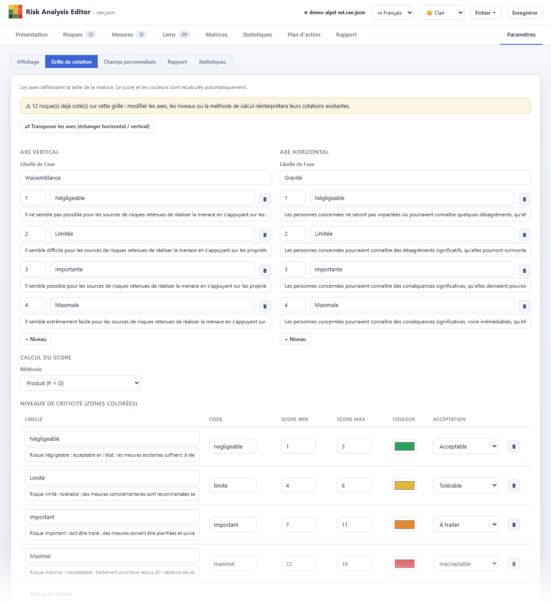

C'est le cœur de la configuration méthodologique. Vous y définissez :

- **Les deux axes** (vertical et horizontal). Dans la démo AIPD, l'axe vertical est la **Vraisemblance** et l'horizontal la **Gravité**, chacun sur 4 niveaux. Vous pouvez ajouter/retirer des niveaux (bouton *+ Niveau*), modifier leur **libellé**, leur **valeur** et une **description** affichée en infobulle. La taille de la matrice découle du nombre de niveaux.
- **La méthode de calcul du score :**
  - **Produit (P × G)** — le score est le produit vraisemblance × gravité ;
  - **Somme (P + G)** ;
  - **Matrice (niveau défini case par case)** — un éditeur dédié vous laisse fixer la valeur de chaque cellule, pour reproduire une échelle qui n'est ni un produit ni une somme.
- **Les niveaux de criticité** — les zones colorées : libellé, code, **score minimum/maximum**, **couleur**, **décision d'acceptation** et description. Un **contrôle de couverture** signale si certains scores atteignables ne tombent dans aucune zone.
- **La transposition des axes** (bouton *⇄ Transposer*) échange vertical et horizontal en un clic, cotations et placements compris.

> ⚠️ **Attention lorsque l'analyse est déjà cotée.** Si des risques sont déjà notés, un bandeau d'avertissement rappelle que modifier les axes, les niveaux ou la méthode de calcul **réinterprétera les cotations existantes** (un même couple vraisemblance/gravité peut changer de signification). Réglez de préférence la grille **avant** de saisir les risques.

### Affichage des matrices

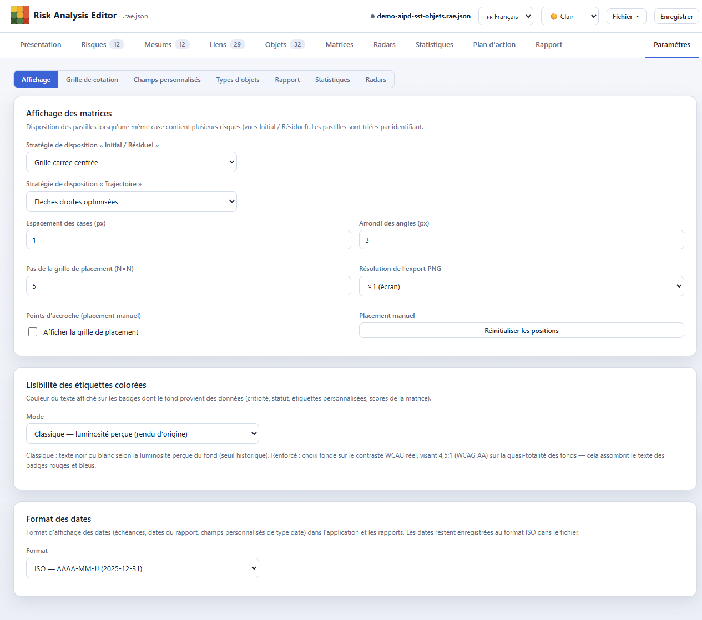

Ce sous-onglet règle le rendu visuel :

- **Stratégie de disposition** des pastilles quand plusieurs risques tombent dans la même case (vues Initial/Résiduel et Trajectoire — voir §9) ;
- **Espacement** des cases, **arrondi** des angles, **pas** de la grille de placement manuel (N×N) ;
- **Résolution de l'export PNG** (×1, ×2, ×3) ;
- affichage de la **grille d'accroche** pour le placement manuel, et bouton de **réinitialisation des positions** ;
- **Lisibilité des étiquettes colorées** : mode *Classique* (luminosité perçue) ou *Contraste renforcé (WCAG AA)*, qui calcule une couleur de texte garantissant un contraste suffisant sur n'importe quel fond ;
- **Format des dates** : format d'affichage des dates (échéances, dates du rapport, champs personnalisés de type date) dans l'application et les rapports — *ISO* (AAAA-MM-JJ, défaut), *JJ/MM/AAAA*, *MM/JJ/AAAA* ou *Long* (localisé selon la langue). Les dates restent enregistrées au format ISO dans le fichier ; seul l'affichage change.

Les champs personnalisés sont traités en [section 14](#14-les-champs-personnalisés).

---

## 5. Décrire l'analyse (onglet Présentation)

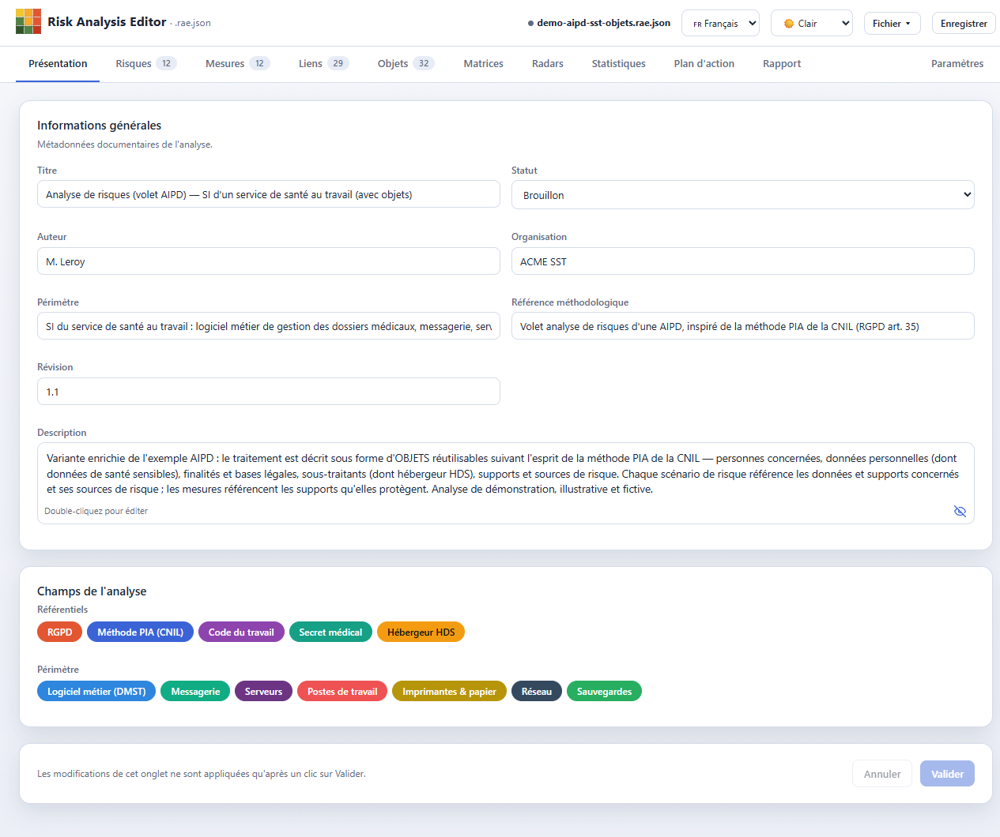

L'onglet **Présentation** rassemble les **métadonnées documentaires** de l'analyse : titre, statut (*Brouillon / Validé / Archivé*), auteur, organisation, périmètre, référence méthodologique, révision et **description** (en Markdown). Ces informations alimentent le cartouche du rapport et des exports.

Si des **champs personnalisés rattachés à l'analyse** ont été définis (dans la démo : *Référentiels*, *Périmètre*), leurs valeurs se saisissent également ici, dans un bloc dédié.

> **Champs en Markdown.** La description (et les zones de **notes** des fiches de risque, de mesure et de lien) accepte une mise en forme **Markdown** simple : titres, **gras**, *italique*, listes, liens… Lorsqu'un champ contient déjà du texte, il s'affiche par défaut sous forme d'**aperçu** mis en forme ; **double-cliquez** dessus pour passer en **édition**, et double-cliquez de nouveau — ou utilisez l'icône **œil** — pour revenir à l'aperçu.

> **Particularité de cet onglet :** les saisies ne sont appliquées qu'après un clic sur **Valider** (bouton local en bas de l'onglet), afin de ne pas marquer l'analyse comme « modifiée » à chaque frappe sur une métadonnée. Le bouton *Annuler* rétablit les valeurs précédentes.

---

## 6. Le registre des risques

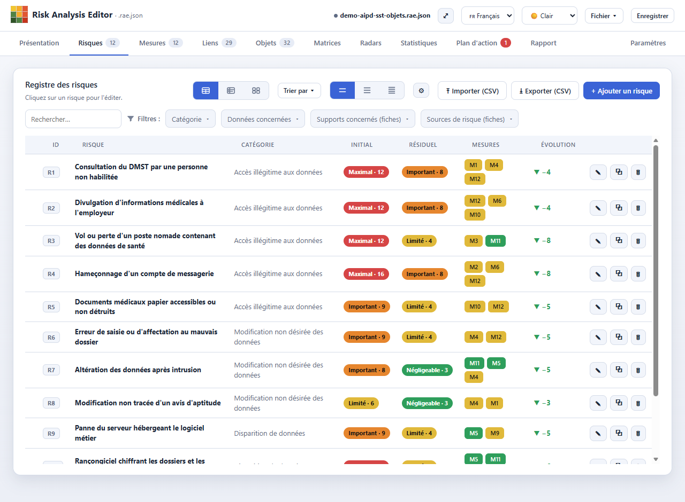

L'onglet **Risques** liste tous les risques de l'analyse. Chaque ligne montre :

- l'**ID** (identifiant, par ex. `R1`) ;
- le **libellé** du risque ;
- la **catégorie** ;
- la cotation **Initial** et **Résiduel** sous forme de pastilles colorées « niveau · score » ;
- les **mesures** qui le traitent (pastilles `M…` cliquables — voir plus bas) ;
- l'**évolution** entre initial et résiduel (▼ réduction, ▲ aggravation, ou « non réduit »).

### Créer ou modifier un risque

Cliquez sur une ligne (ou sur l'icône ✎) pour ouvrir la **fiche du risque**. Un clic sur une **cellule précise** ouvre la fiche **directement sur le champ correspondant** : cliquez la *catégorie* pour éditer la catégorie, une pastille de *cotation* pour vous placer sur ce bloc d'évaluation, la colonne *mesures* pour ouvrir la section des liens, etc. Ce confort de saisie vaut aussi pour les onglets **Mesures**, **Liens** (vue *Détails*), **Objets** et **Plan d'action** (échéancier, statut, par responsable).

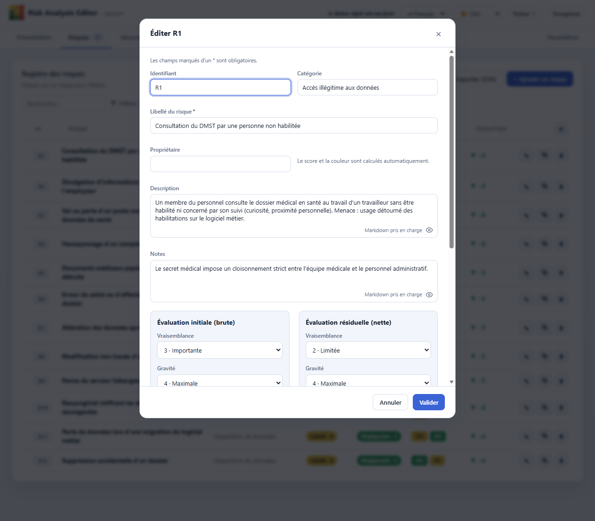

La fiche regroupe :

- **Identifiant**, **catégorie**, **libellé** (obligatoire), **propriétaire** ;
- **Description** et **Notes**, tous deux en **Markdown** (aperçu mis en forme par défaut ; **double-clic** ou icône œil pour basculer entre aperçu et édition — voir [§5](#5-décrire-lanalyse-onglet-présentation)) ;
- l'**évaluation initiale (brute)** et l'**évaluation résiduelle (nette)** : vraisemblance et gravité. Le score et la criticité sont **calculés et affichés automatiquement** sous chaque bloc. Si des **champs personnalisés de cotation** ont été définis (cible *évaluation du risque*, voir [§14](#14-les-champs-personnalisés)), ils se saisissent **sous chaque bloc**, avec une valeur **distincte** pour l'évaluation initiale et pour la résiduelle (dans les modèles EBIOS RM et ISO 27005 : *Justification* et *Date de cotation*) ;
- la section **Mesures de maîtrise liées** (à cocher) ;
- les **champs personnalisés** de risque, le cas échéant.

Le bouton principal est **Créer** (nouvelle fiche) ou **Valider** (modification). À la création, un bouton **Enregistrer et nouveau** permet d'enchaîner les saisies sans rouvrir la fiche à chaque fois.

### Dupliquer, supprimer, réordonner

Chaque ligne offre trois actions :

- **✎ Modifier** ;
- **⧉ Dupliquer** — ouvre une **fiche de création pré-remplie** (identifiant suivant, libellé suffixé « (copie) », mesures associées reprises). La copie n'est créée **qu'à la validation** ;
- **🗑 Supprimer** — après confirmation. Un message **« Annuler »** apparaît alors quelques secondes pour **restaurer** la fiche supprimée (liens compris) en cas d'erreur.

**Réordonner les lignes.** Lorsqu'aucun tri de colonne n'est actif, une **poignée ⠿** apparaît au survol dans la colonne ID : glissez-la pour changer l'ordre des risques dans le fichier (au clavier : `Ctrl+↑`/`Ctrl+↓`). Cet ordre gouverne l'affichage par défaut, le rapport et les exports. Voir [§16](#16-rechercher-trier-filtrer-personnaliser-les-colonnes).

---

## 7. Les mesures de maîtrise

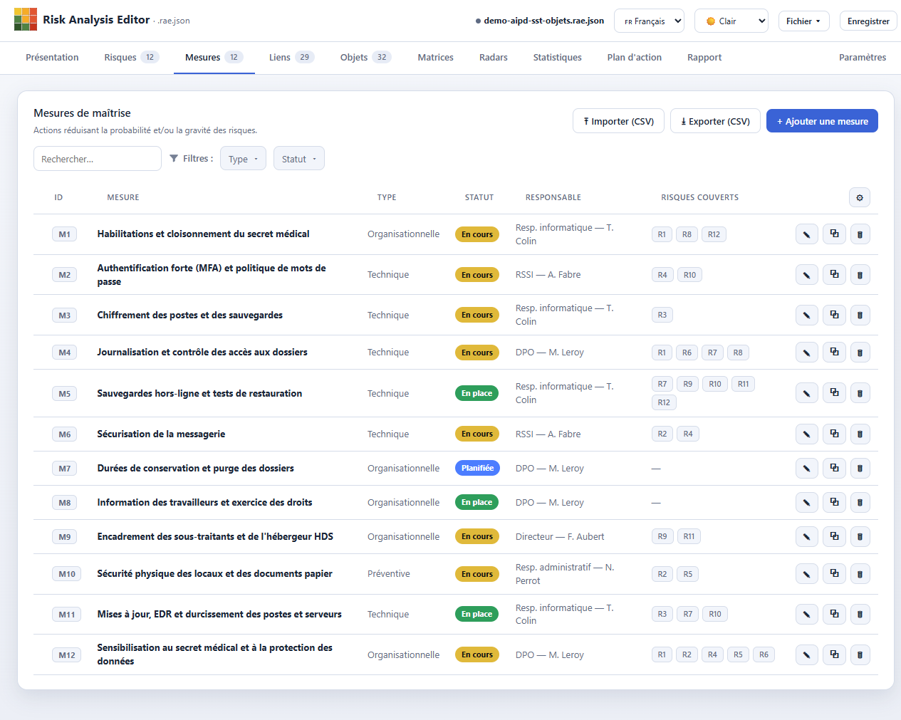

L'onglet **Mesures** liste les actions qui réduisent la probabilité et/ou la gravité des risques. Chaque mesure porte : un **type** (technique, organisationnelle, préventive…), un **statut** à code couleur (*Proposée, Planifiée, En cours, En place, Abandonnée*), un **responsable**, une **échéance**, un **coût**, et les **risques couverts**.

Le fonctionnement du registre est identique à celui des risques : recherche, tri, filtres, colonnes personnalisables, duplication (⧉), suppression avec annulation, et réordonnancement par poignée.

### Fiche d'une mesure

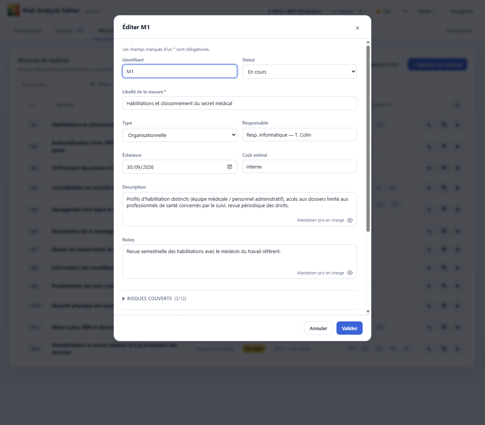

La fiche permet de renseigner le libellé, le type, le statut, le responsable, l'échéance, le coût, une description et des notes (Markdown), les **risques couverts** (à cocher), et les **champs personnalisés** de mesure (dans la démo : *Avancement* en barre de progression, *Nature*, *Objectif*).

---

## 8. Les liens risques ↔ mesures

L'onglet **Liens** matérialise le fait qu'une mesure traite un ou plusieurs risques (relation plusieurs-à-plusieurs). Il comporte deux sous-onglets.

### Associations

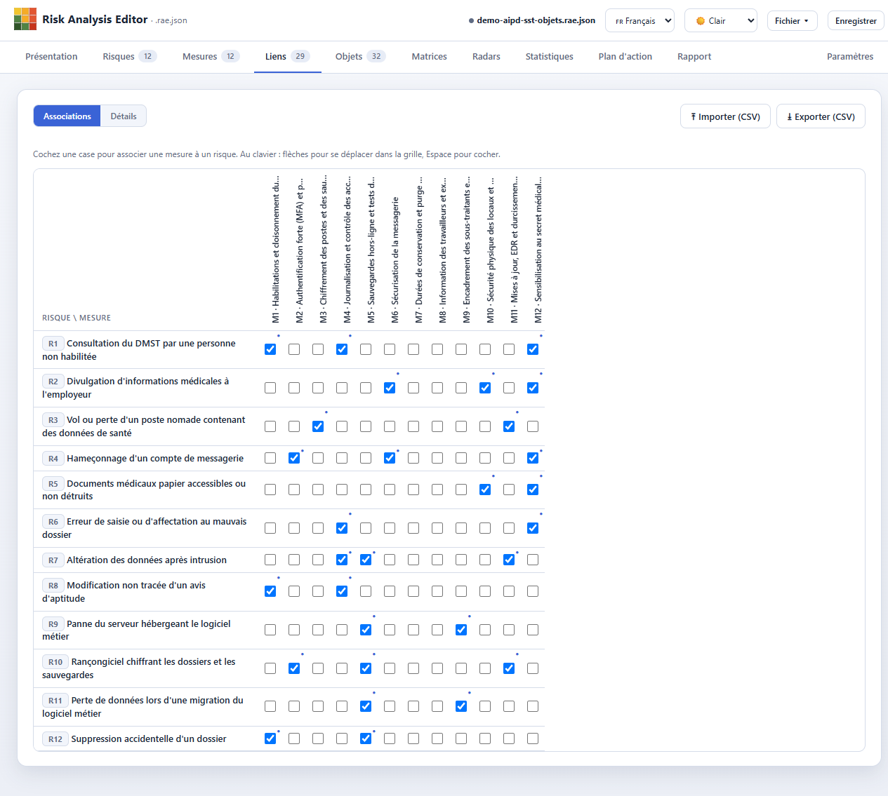

Un **tableau croisé** risques × mesures : cochez une case pour associer une mesure à un risque. Une confirmation est demandée à chaque coche ; en phase d'association massive, vous pouvez cocher **« Ne plus demander (pour cette session) »** dans la boîte de confirmation. Les liens **enrichis** (porteurs d'une note ou de champs personnalisés) sont signalés dans le tableau.

Au clavier : les flèches déplacent le curseur dans la grille, `Espace` coche/décoche.

### Détails

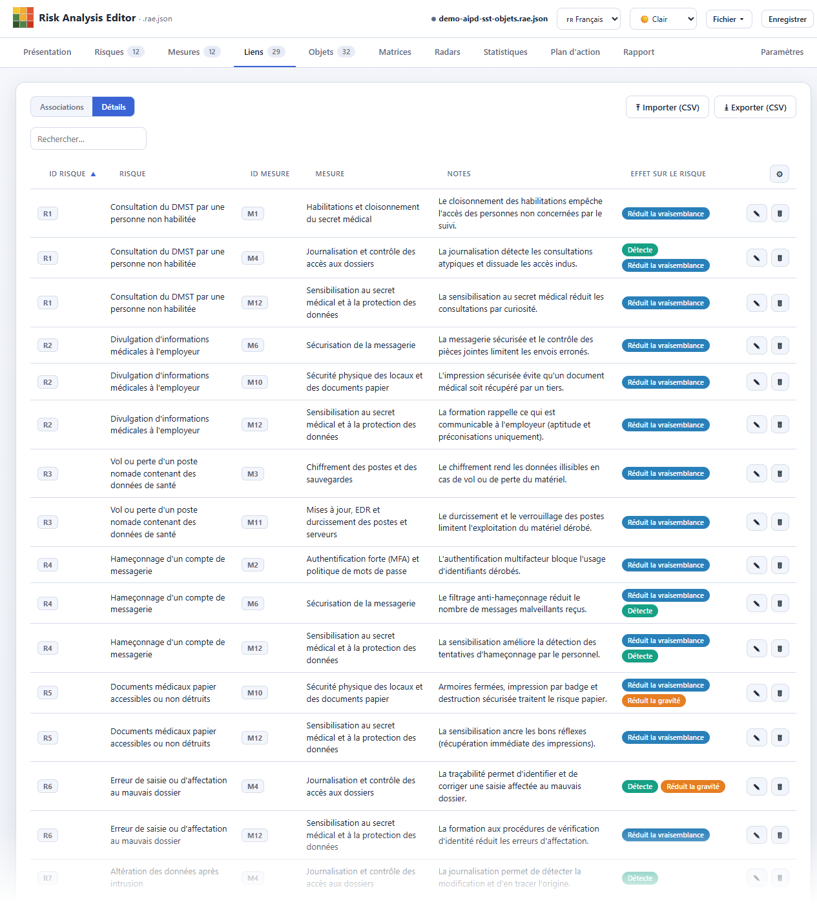

Un **registre éditable** des liens existants, où chaque lien porte une **note** (justification « pourquoi cette mesure agit sur ce risque ») et ses propres **champs personnalisés** de lien (dans la démo : *Effet attendu*). Comme les autres registres, il est triable, filtrable et ses colonnes sont personnalisables.

Cliquez sur une ligne pour ouvrir la **fiche du lien** :

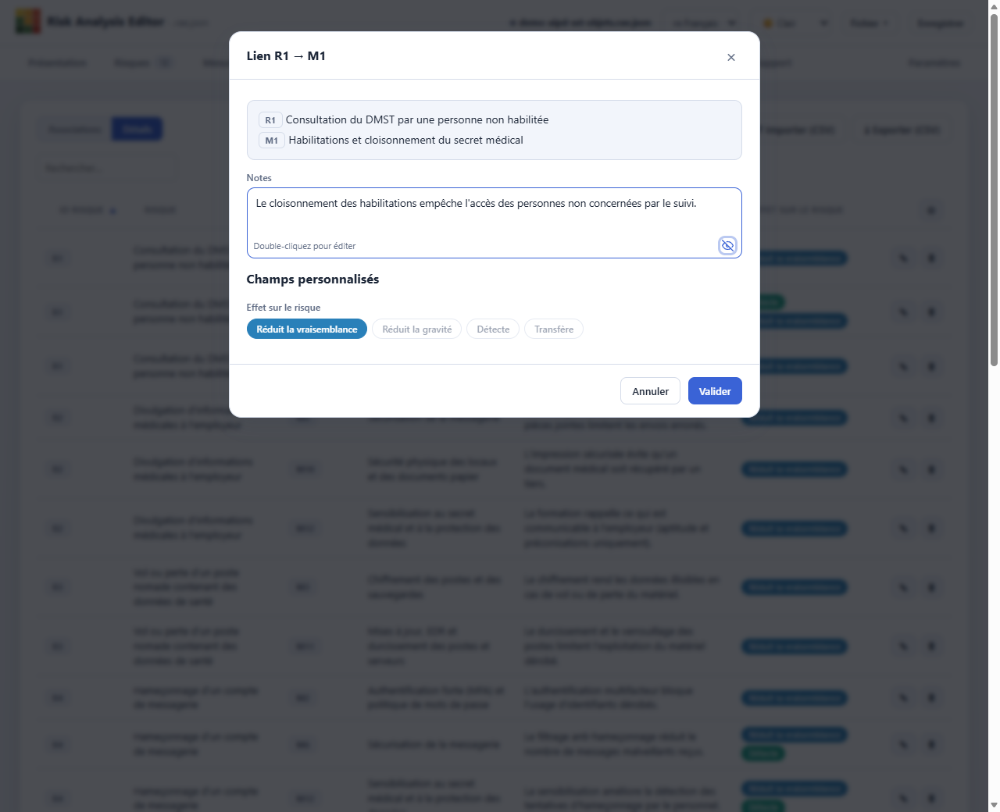

---

## 9. Les matrices

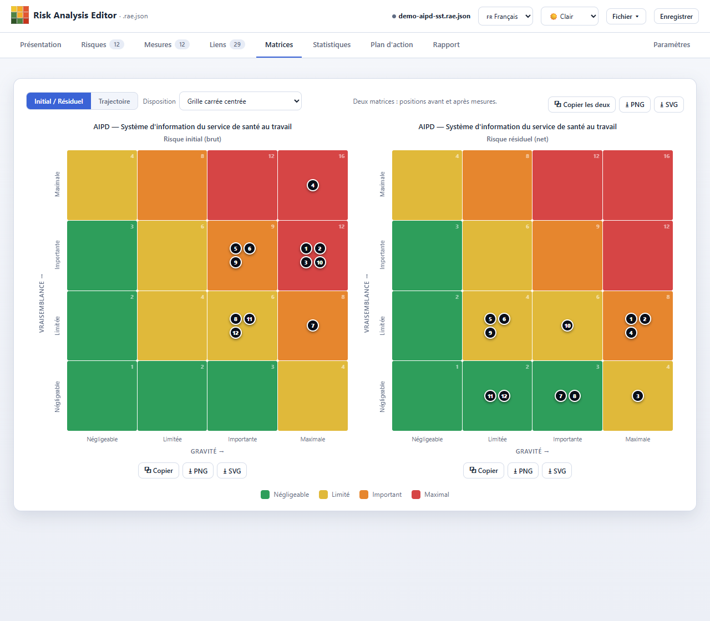

L'onglet **Matrices** est le point fort visuel de l'outil : il montre le positionnement des risques avant et après mesures. La synthèse chiffrée (compteurs, répartition par criticité) est regroupée dans l'onglet [**Statistiques**](#11-les-statistiques).

Deux vues, sélectionnables par la bascule en haut à gauche :

- **Initial / Résiduel** — deux matrices côte à côte : les positions **avant** et **après** mesures. Chaque risque est une **pastille** placée dans la case (vraisemblance × gravité) correspondant à sa cotation.
- **Trajectoire** — une seule matrice où une **flèche** relie la position initiale (contour pointillé) à la position résiduelle (contour plein) de chaque risque. Les risques **non réduits** sont mis en évidence.

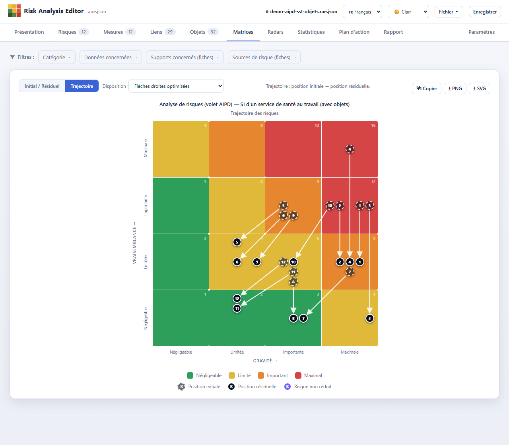

Autres commandes :

- **Disposition** — comment répartir plusieurs pastilles dans une même case (grille carrée centrée, rangée, colonne, amas/spirale, débordement « +N »…). En vue Trajectoire, une disposition « flèches droites optimisées » minimise les croisements. La disposition **Manuel** ajoute en plus un **placement fin** des pastilles à l'intérieur de leur case au glisser-déposer (avec grille d'accroche) ; ces positions sont enregistrées dans le fichier.
- **Copier**, **PNG**, **SVG** — exportent les matrices comme image (copie dans le presse-papiers, PNG en ×1/×2/×3, ou SVG vectoriel), avec titre, axes et légende.

> **Recoter au glisser-déposer.** Dans **toutes les matrices** (Initial, Résiduel, Trajectoire) et **quelle que soit la disposition**, vous pouvez **faire glisser une pastille vers une autre case** : la **cotation** du risque est mise à jour en conséquence — sa **vraisemblance (P)** et sa **gravité (G)** prennent les valeurs de la case d'arrivée, et un message confirme la nouvelle cotation. Dans la vue Initial/Résiduel, déplacer la pastille de gauche modifie la cotation **initiale**, celle de droite la cotation **résiduelle** ; en Trajectoire, le déplacement ajuste la position **résiduelle**. Au clavier, `Ctrl` + les flèches déplacent la pastille sélectionnée de case en case.

> **Éditer au clic.** Un **clic** sur une pastille ouvre la **fiche du risque** (au clavier : `Entrée` ou `Espace` sur la pastille sélectionnée). Le clic et le glisser-déposer ne se confondent pas : un simple clic édite, un glisser recote.

> Les pastilles portent un numéro. Lorsque tous les identifiants sont au format `R…` (comme dans la démo), c'est le numéro de l'identifiant ; sinon les risques sont numérotés selon leur ordre dans le fichier. Le survol d'une pastille affiche l'identifiant complet, le libellé et la cotation.

---

## 10. Les radars

L'onglet **Radars** propose une lecture synthétique du **profil de risque** sous forme de **graphique en radar** (toile d'araignée) : chaque **axe** est une valeur d'analyse et un **polygone** relie les valeurs mesurées sur ces axes. Il faut **au moins trois axes** pour tracer un radar.

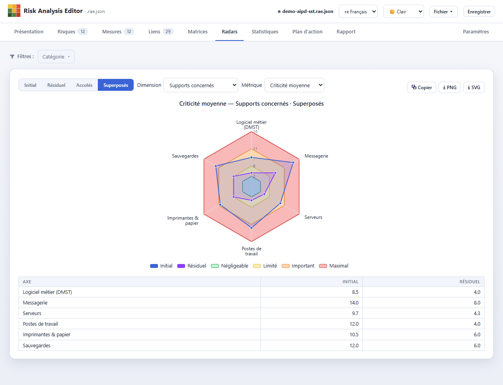

Une **barre d'outils** pilote l'affichage :

- **Évaluation** — *Initial*, *Résiduel*, *Accolés* (deux radars côte à côte) ou *Superposés* (deux polygones sur le même radar, pour visualiser la réduction du risque).
- **Dimension** — ce que représentent les axes : la **catégorie** de risque, ou un **champ personnalisé à valeurs fermées** rattaché au risque (liste déroulante, tags, liste à cocher, **échelle**, **référence** à un objet).
- **Axes vides** — case à cocher (**cochée par défaut**) : affiche **tous les axes possibles** (toutes les valeurs connues), y compris ceux **sans risque** dans la vue — item ou instance non utilisé, **ou valeur écartée par un filtre actif**. Les axes restent ainsi **stables** quand vous filtrez : un axe concerné tombe à **0** au lieu de **disparaître** (ce qui déformait le radar). Décochez la case pour ne conserver que les axes **présents dans la vue**. Disponible pour **toutes les dimensions**, catégorie comprise (dont l'univers d'axes est l'ensemble des catégories de tous les risques).
- **Métrique** — la valeur mesurée sur chaque axe :
  - **Criticité moyenne** / **Criticité maximale** — sur l'échelle **par risque** de la grille ; le fond est teinté en **bandes de criticité** (mêmes couleurs que la grille).
  - **Criticité cumulée** — la **somme** des scores de l'axe : tient compte à la fois de la gravité **et** du nombre de risques.
  - **Criticité pondérée** — la somme des **poids** de niveau (voir *Paramètres › Radars* ci-dessous) : permet de faire dominer les risques les plus graves.
  - **Nombre de risques** — l'effectif de l'axe (indépendant de l'évaluation).
  - **Champ numérique** (*moyenne* / *max* / *somme*) — agrège la valeur d'un **champ de risque** de type **échelle** ou **calculé numérique** sur les risques de l'axe ; indépendant de l'évaluation. Les champs éligibles apparaissent dans un sous-groupe du menu **Métrique**.

> Les métriques **cumulée**, **pondérée**, **nombre** et **champ numérique** sont affichées sur fond **neutre** avec **échelle automatique**, sans bandes de criticité. (*Cumulée*, *pondérée*, *nombre* et *champ (somme)* sont en outre *extensives* : leur valeur croît avec le nombre de risques.)

**Infobulles au survol** (comme sur les secteurs des Statistiques) : un **point** affiche la **liste des risques** de l'axe ; un **libellé d'axe** affiche la **description** de la valeur (pour un champ personnalisé dont l'item porte une description) ; un **niveau** dans la légende affiche la **description du niveau de criticité**.

Sous le graphique, un **tableau** récapitule les valeurs par axe. Comme les autres onglets, le radar **respecte les filtres actifs** (§16).

> Les réglages de la barre d'outils (**dimension**, **métrique**, **évaluation** et **axes vides**) sont **enregistrés avec l'analyse** et **retrouvés à la réouverture** du fichier.

**Exporter.** Les boutons **⧉ Copier**, **⭳ PNG** et **⭳ SVG** exportent le radar (titre, graphique et légende), comme les matrices. Le radar peut aussi être ajouté au **rapport** via une section *Radar* configurable (voir *Paramètres › Rapport*, §13).

### Paramètres › Radars

Un sous-onglet dédié dans *Paramètres* règle deux choses, enregistrées **avec l'analyse** (donc portables avec le fichier) :

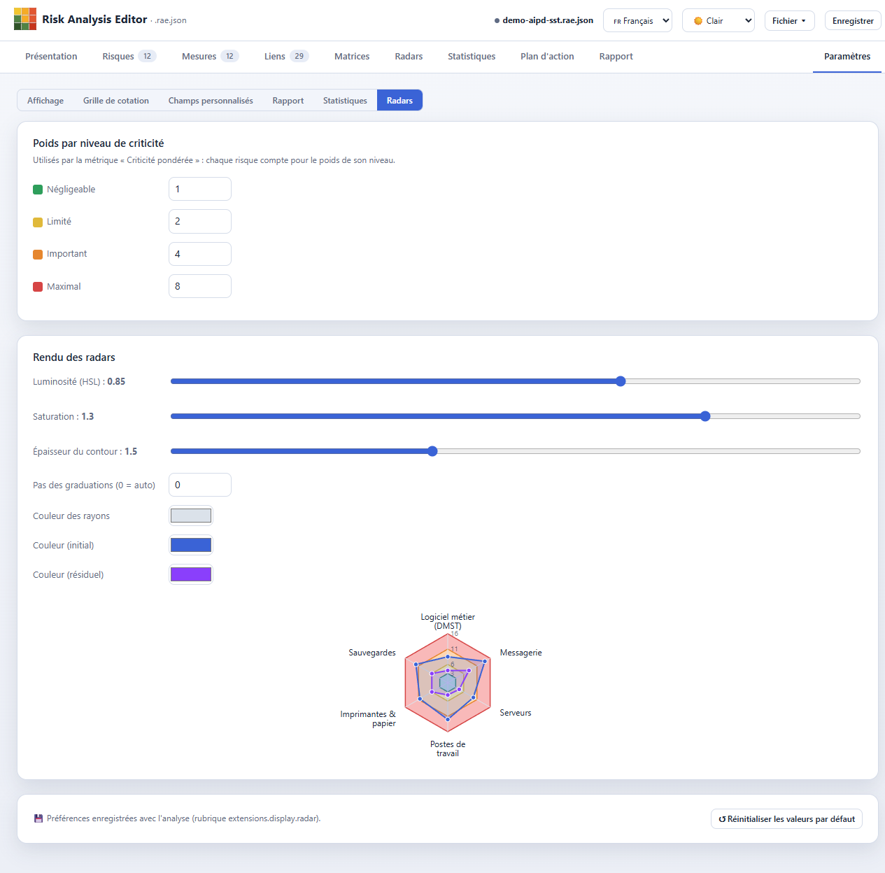

- **Poids par niveau de criticité** — utilisés par la métrique *Criticité pondérée* : chaque risque compte pour le poids de son niveau (par défaut **1 / 2 / 4 / 8**, du plus faible au plus grave).
- **Rendu des radars** — **luminosité** et **saturation** (HSL) des bandes de fond, **épaisseur du contour**, **pas des graduations** (`0` = automatique), **couleur des rayons** et **couleurs des évaluations initiale et résiduelle** (contour et pastilles), avec un **aperçu** en direct. Ces réglages s'appliquent à l'écran, à l'export et au rapport.

---

## 11. Les statistiques

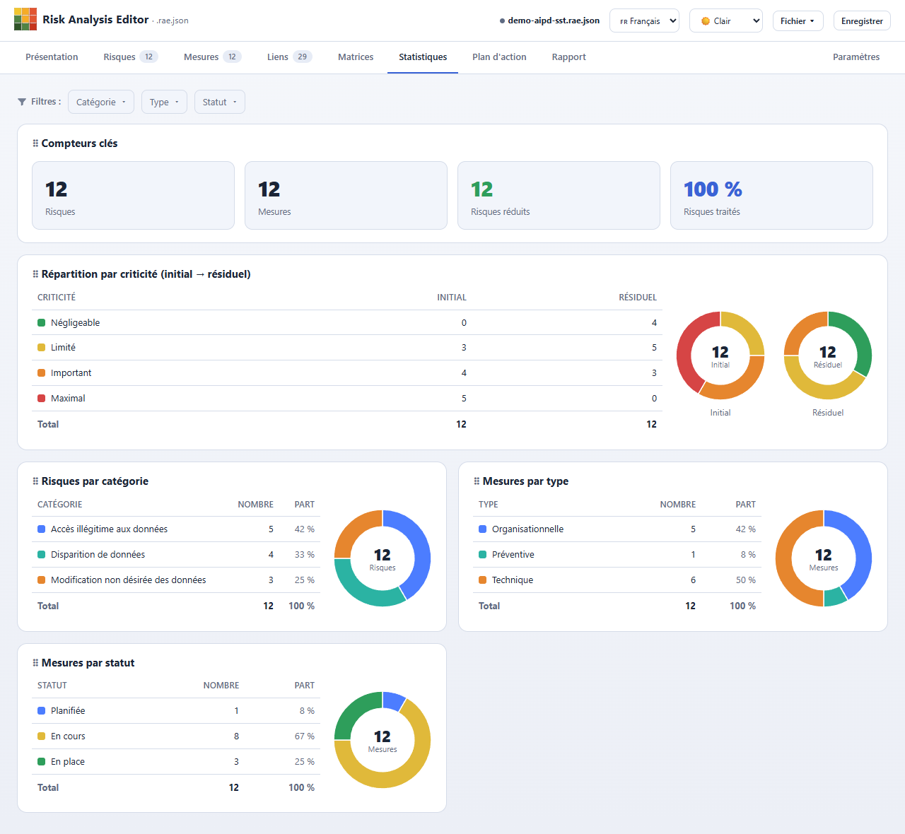

L'onglet **Statistiques** est un **tableau de bord chiffré** de l'analyse. Comme les matrices, il **suit le filtrage propagé** : filtrer sur une catégorie, un type ou un champ personnalisé restreint aussitôt tous les blocs (un compteur *« n sur N »* et un bouton *Réinitialiser* apparaissent dès qu'un filtre est actif).

Les données sont présentées en **blocs**, chacun sous forme de **tableau**, de **graphique** (anneau ou camembert) ou des **deux** côte à côte :

- **Compteurs clés** — nombre de risques, de mesures, de risques réduits, et pourcentage de risques traités.
- **Répartition par criticité** — la distribution *initiale → résiduelle* (deux anneaux), qui montre le glissement du risque après mesures.
- **Risques par catégorie**, **Mesures par type**, **Mesures par statut**.
- **En option** : *Risques* / *Mesures par responsable*, **Couverture** (risques sans mesure, mesures orphelines), une **répartition par champ personnalisé** et un **agrégat numérique** (autant de blocs que voulu). Pour un champ **multi-valeur** (liste à cocher, étiquettes), le centre de l'anneau compte des **valeurs**, pas des entités. Un **agrégat numérique** résume un champ *échelle* ou *calculé numérique* de risque, mesure ou lien sous forme de **tuiles** : effectif renseigné, **moyenne**, **somme**, **min**, **max**.

**Manipuler la grille.** Chaque bloc se **déplace** (glisser la poignée **⠿** ou son titre), se **redimensionne** (bouton **⤢** : pleine ↔ demi-largeur) et se **retire** (**✕**) directement sur la grille ; les blocs d'une même rangée gardent la même hauteur. Toute action est **répercutée dans les options** et enregistrée dans le fichier.

**Personnaliser (Paramètres › Statistiques).** Le sous-onglet reprend tous les blocs dans une liste ordonnable : cochez ceux à afficher, **glissez la poignée ⠿** pour les réordonner, et réglez pour chacun la **taille** (pleine / demi-largeur), l'**affichage** (tableau / graphique / les deux) et la **forme** du graphique (anneau / camembert). Le bouton **+ Ajouter un bloc « champ personnalisé »** crée une répartition sur le champ de votre choix, **+ Ajouter un agrégat numérique** un bloc de tuiles pour un champ *échelle* ou *calculé numérique* ; **↺ Réinitialiser par défaut** rétablit la configuration standard. Les réglages sont **enregistrés dans le fichier** (`extensions.display.stats`).

---

## 12. Le plan d'action

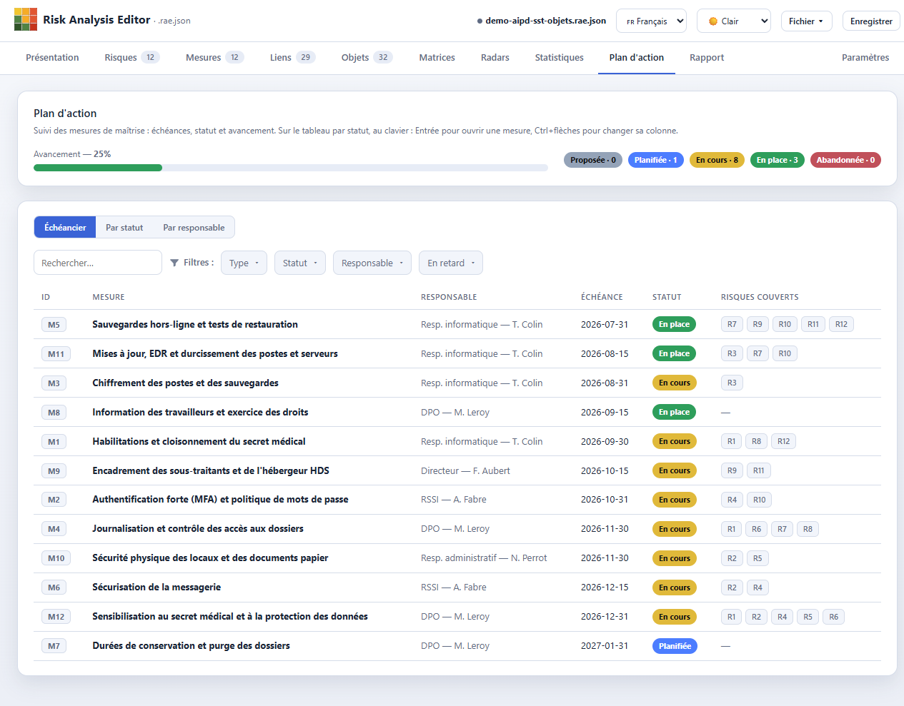

L'onglet **Plan d'action** transforme les mesures en suivi opérationnel, à travers trois présentations (bascule en haut) :

- **Échéancier** — la liste des mesures triée par date d'échéance ;
- **Par statut** — un **kanban** : chaque mesure est une carte dans la colonne de son statut, que l'on **glisse-dépose** d'une colonne à l'autre (au clavier : `Ctrl+flèches`) ;
- **Par responsable** — les mesures regroupées par personne responsable.

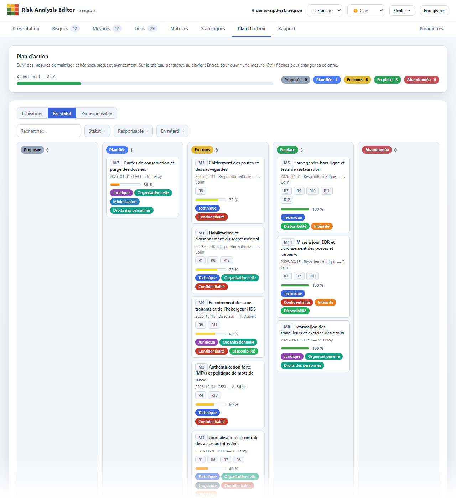

Un bloc de **synthèse** affiche l'avancement global (barre + compteurs par statut). Les mesures **en retard** (échéance passée et non finalisées) sont mises en évidence. Chaque carte est **éditable au clic** (elle ouvre la fiche de la mesure).

---

## 13. Le rapport

L'onglet **Rapport** génère un rapport configurable, prêt à imprimer. Par défaut, il comporte une **page de garde**, une **table des matières**, puis : le cartouche (métadonnées), un bloc **Présentation** (description et champs de l'analyse), la **synthèse** (compteurs et répartition par criticité), la **grille de cotation** détaillée, les **référentiels et légendes des champs** (valeurs des listes/tags accompagnées de leur description), les **matrices**, le **registre des risques** et le **détail** des risques, les **mesures**, les **liens** et le **plan d'action**.

Le bouton **🖨 Imprimer** ouvre la boîte d'impression du navigateur : choisissez « Enregistrer au format PDF » pour produire un PDF. Le bouton **⭳ Word (.docx)** exporte le même rapport en document Word éditable (voir §18).

### Personnaliser le rapport (Paramètres › Rapport)

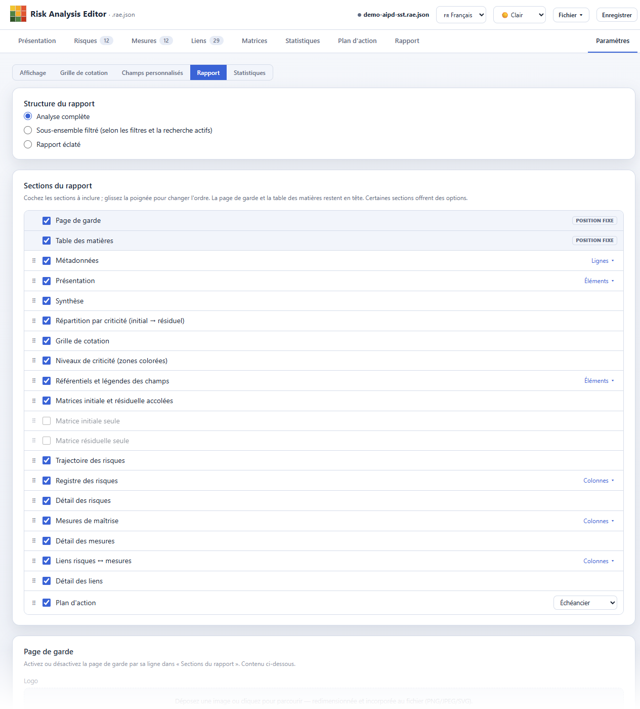

Le sous-onglet **Paramètres › Rapport** permet d'adapter finement le contenu et la mise en forme du rapport. Les préférences sont **enregistrées dans le fichier** `.rae.json` et pilotent à la fois l'aperçu à l'écran, l'impression PDF et l'export Word.

- **Sections & ordre** — cochez les sections à inclure et **glissez la poignée ⠿** pour les réordonner. La page de garde et la table des matières restent en tête.
- **Page de garde** — logo (déposé ou parcouru, redimensionné et incorporé au fichier), titre, sous-titre, affichage de l'organisation / auteur / date, version, mention de confidentialité et texte libre (Markdown).
- **Table des matières** — activable ; rendue en table des matières **native** (mise à jour à l'ouverture) dans l'export Word.
- **En-tête / pied de page** — trois zones (gauche, centre, droite) avec des **variables** insérables (`{title}`, `{organization}`, `{author}`, `{date}`, `{version}`, `{confidentiality}`, `{page}`, `{pages}`). ⚠️ **Réservé à l'export Word** : l'en-tête et le pied de page n'apparaissent pas à l'écran ni à l'impression PDF.
- **Colonnes des tableaux** — pour chaque registre (risques, mesures, liens), choisissez les colonnes et leur ordre (champs personnalisés compris) ; de même pour les **lignes du cartouche** de métadonnées et les **éléments de la Présentation**.
- **Matrices** — trois sections indépendantes : *initiale et résiduelle accolées* (cochée par défaut), *initiale seule*, *résiduelle seule*.
- **Plan d'action** — présentation au choix : échéancier, par statut ou par responsable.
- **Orientation** — portrait (par défaut) ou paysage.
- **Structure du rapport** — trois modes exclusifs : *Analyse complète* ; *Sous-ensemble filtré* (selon les filtres et la recherche actifs — une section **« Périmètre filtré »** récapitule alors les filtres appliqués et le nombre d'éléments retenus **sur le total** `n / N`) ; ou ***Rapport éclaté***.
- **Rapport éclaté** — le rapport se **répète pour chaque valeur d'un critère**, chaque chapitre étant automatiquement filtré : par **catégorie de risque**, **type de mesure**, **propriétaire du risque**, **responsable de la mesure**, **champ personnalisé** (à valeurs fermées), ou **un chapitre par risque** (fiche détaillée + matrice de trajectoire + mesures liées). Le **tri des chapitres** se choisit (par criticité du plus critique, alphabétique, ou nombre de risques ; le groupe « valeur vide » — non catégorisé, sans propriétaire… — finit toujours en dernier). En mode éclaté, chaque **section** se place dans une **zone**, via le menu apparu sur chaque ligne : *en tête* (une fois), *répétée* (dans chaque chapitre, filtrée) ou *annexe* (une fois, non filtrée). L'éclaté part de l'**analyse complète** et s'applique à l'aperçu écran, à l'impression PDF **et** à l'export Word.

Le bouton **↺ Réinitialiser le rapport par défaut** efface la personnalisation et rétablit le modèle par défaut.

---

## 14. Les champs personnalisés

Les **champs personnalisés** étendent le modèle de données pour l'adapter à votre méthode. Ils se définissent dans *Paramètres › Champs personnalisés*.

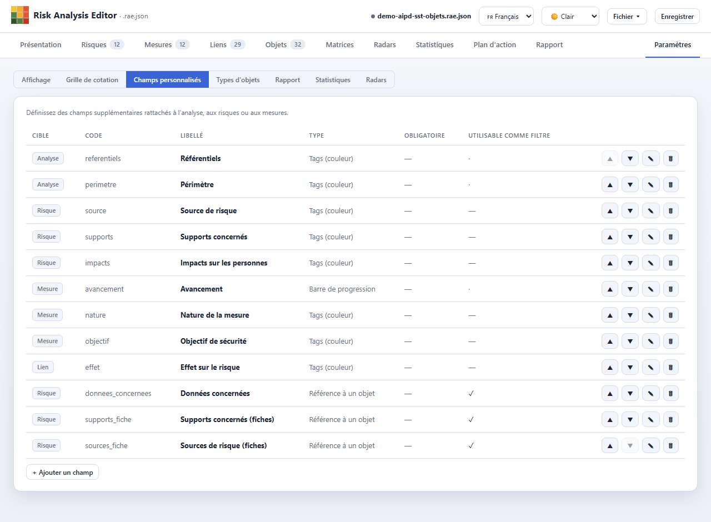

Chaque champ possède :

- une **cible** — à quel objet il se rattache : *analyse*, *risque*, *évaluation du risque* (cotation), *mesure* ou *lien*. Un champ rattaché à l'**évaluation du risque** est proposé sous les deux blocs d'évaluation d'un risque (initial et résiduel), avec une valeur distincte pour chacun ;
- un **code** (identifiant technique) et un **libellé** (multilingue) ;
- un **type** : oui/non, entier, décimal, date, texte, texte long, URL, e-mail, téléphone, texte contrôlé (regexp), **couleur** (sélecteur de couleur ; option d'**affichage** au choix : *pastille + valeur hexa*, *pastille seule* ou *valeur hexadécimale*), **image** (téléversée et embarquée dans l'analyse, affichée en vignette ; les images trop grandes sont automatiquement réduites — un **clic sur la vignette l'affiche en grand** sur fond obscurci, fermeture par clic, ✕ ou *Échap*), liste déroulante, liste à cocher, **tags colorés** (choix unique ou multiple), **échelle** (niveaux à valeur numérique, exploitable dans des calculs — pastille colorée optionnelle), **barre de progression** (0–100 %) et **valeur calculée** (une formule, style Excel, sur les autres champs de la fiche et des grandeurs dérivées comme le score ou l'échéance ; champ dérivé, non saisi, recalculé à l'affichage). Un champ peut aussi être une **référence à un objet** (voir §15) ;
- des attributs optionnels : **obligatoire**, bornes (min/max, longueur, nombre d'items), une **aide** et une **description** ;
- l'option **Utilisable comme filtre** (pour les types à valeurs fermées — et les **valeurs calculées** à résultat *oui/non* ou dotées d'une *alerte* — rattachés à un risque, une mesure ou un lien ; voir §16).

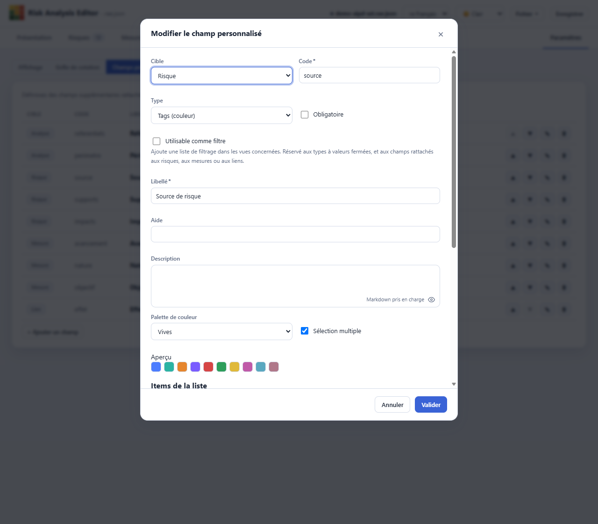

Pour un champ **tags colorés**, une **palette de couleur** prédéfinie colore automatiquement les valeurs, dans l'ordre : palettes *qualitatives* (Vives, Pastel, Office, adaptée aux daltoniens, Chaudes, Froides) ou *séquentielles* (Nuances de gris, Bleu → Vert, Jaune → Orange, Rouge → Violet). Au-delà du nombre de couleurs de la palette, celle-ci se répète avec une légère **nuance de luminosité** pour garder des teintes distinctes. Chaque couleur reste **modifiable** individuellement, et l'option **Personnalisée** laisse fixer chaque valeur à la main.

Les **valeurs** des champs se saisissent ensuite dans les fiches (risque, mesure, lien), **sous chaque bloc d'évaluation** pour les champs de cotation, et, pour les champs d'analyse, dans l'onglet *Présentation*. Elles sont reprises dans le **rapport**, l'**import/export CSV** et les **exports Word/Excel** — les champs de cotation y disposent de **colonnes distinctes** pour l'évaluation *initiale* et *résiduelle* — et peuvent devenir des **colonnes** dans les registres.

Pour les listes (**liste déroulante**, **liste à cocher**, **tags**), chaque **valeur** peut recevoir une **description** (saisie sous la valeur dans l'éditeur). Ces descriptions s'affichent en **infobulle** au survol des **tags** (dans les fiches comme dans les registres) et alimentent une section **« Référentiels et légendes des champs »** du rapport : un tableau *valeur → description* pour chaque champ concerné, utile pour documenter le vocabulaire de la méthode (sources de risque, événements redoutés, types de menace…). Dans *Paramètres › Rapport*, la sous-liste **« Éléments »** de cette section permet de **choisir et d'ordonner** les champs à y inclure. Les modèles et les démonstrations fournis en sont déjà pourvus.

> Les libellés et l'aide se saisissent dans la langue de l'interface active ; à défaut de traduction, le code du champ est affiché.

> ⚠️ **Champ déjà utilisé.** Si vous **supprimez** un champ qui contient déjà des valeurs, si vous **changez sa cible** (par ex. de *risque* à *mesure*) ou si vous **changez son type** de façon incompatible (par ex. de *tags* à *texte*), l'outil indique combien de valeurs sont concernées et avertit qu'elles deviendront inaccessibles ou inexploitables, avant d'appliquer.

### Le type « échelle »

Une **échelle** est une liste de **niveaux**, chacun défini par une **valeur numérique** et un **libellé** (par exemple *1 = Faible, 2 = Moyen, 3 = Fort, 4 = Critique*). La valeur numérique **tient lieu d'identité** du niveau : c'est elle qui est **stockée** et qui est **exploitée dans les calculs, les statistiques et les radars**. Chaque niveau peut recevoir une **couleur** (pastille) et une **description**, toutes deux optionnelles.

- **Saisie** : une liste déroulante propose les niveaux (avec leur pastille de couleur s'il y en a).
- **Valeurs fermées** : une échelle peut servir de **filtre** (par niveau), de **répartition** dans les statistiques et de **dimension** de radar.
- **Dans une formule** : `cf.<code>` d'une échelle vaut **directement le nombre** (sa valeur), donc réutilisable tel quel dans une *valeur calculée*.

### Le type « valeur calculée »

Une **valeur calculée** est un champ **dérivé** : au lieu d'être saisie, elle est obtenue par une **formule** que l'outil **recalcule en direct** à l'affichage (fiche, registre, rapport…). La syntaxe s'inspire des **formules Excel**.

**La formule et le picker.** L'éditeur de formule est accompagné d'un **picker** (sélecteur) organisé en onglets pour insérer les éléments au curseur, sans faute de frappe :

- **Champs** — les autres champs personnalisés de la même fiche, insérés sous la forme `cf.<code>` ;
- **Base** — les champs de base et **grandeurs dérivées** de l'élément : pour un risque `score_initial`, `criticality_residual`, `category`… ; pour une mesure `due_date`, `cost`, `overdue`… ; pour l'analyse, des **agrégats de collection** (`risks_count`, `AVERAGE(risks.cf.<code>)`, `SUM(measures.cost)`…) ;
- **Objets liés** — *n'apparaît que si la fiche possède au moins un champ **référence*** : les jetons de **traversée** groupés par champ référence (le champ lui-même, puis les attributs numériques des objets pointés — voir plus bas) ;
- **Fonctions** et **Opérateurs** — voir ci-dessous.

Dans les onglets *Champs*, *Base* et *Objets liés*, une **petite icône** rappelle le **type** de chaque champ (nombre, texte, date, échelle, calcul…) pour composer la formule d'un coup d'œil. Une fonction insérée **entoure** le texte sélectionné le cas échéant : sélectionner `cf.cout` puis cliquer *ROUND* donne `ROUND(cf.cout)`.

**Les fonctions disponibles** (liste blanche) : agrégats **SUM, AVERAGE, MEDIAN, MIN, MAX, COUNT** ; arithmétique **ROUND, ROUNDUP, ROUNDDOWN, INT, ABS, MOD, POWER, SQRT** ; logique **IF, AND, OR, NOT** ; texte **CONCAT, LEN** (et l'opérateur `&`) ; dates **TODAY, DATE, YEAR, MONTH, DAY, EDATE, DATEDIF**. Opérateurs `+ − * / ^` et comparaisons `= <> < <= > >=`. Toute référence ou fonction inconnue est signalée à la saisie.

> **Compter les valeurs d'un champ multivalué.** Un champ *liste à cocher*, *étiquettes* ou *référence* multiple est vu comme une **liste** : `COUNT(cf.<code>)` en donne le **nombre de valeurs** (0 s'il est vide). En contexte texte, la liste s'écrit valeurs jointes par « , ».

> **Agréger les attributs des objets référencés.** Si un champ **référence** pointe vers des objets, la notation `cf.<champ_référence>.cf.<attribut>` donne la **liste** de cet attribut sur **tous les objets référencés** — donc directement agrégeable. Exemple : un risque référence des *Valeurs métier* dotées d'une échelle *Niveau de risque* ; on obtient alors la moyenne, la somme, le pire cas ou le nombre par `AVERAGE(cf.valeurs_metier.cf.niveau_risque)`, `SUM(…)`, `MAX(…)`, `COUNT(…)`. L'attribut visé peut être une **échelle**, un **numérique** ou un attribut **calculé** de l'objet ; les jetons correspondants sont proposés dans l'onglet **Objets liés** du picker, groupés sous leur champ référence. La traversée est limitée à **un seul saut** (risque → objet référencé).

**Le type du résultat.** Vous choisissez le **type de résultat** — *nombre*, *entier*, *date*, *texte* ou *oui/non* — qui détermine la mise en forme. Pour un *nombre*, vous pouvez fixer un nombre de **décimales** et une **unité** (suffixe, par ex. « pts », « € »). Une **date** calculée suit le **format de date global** de l'analyse. Le caractère *obligatoire* n'a pas de sens ici et n'est pas proposé.

**Aperçu en direct.** Une valeur calculée ne se **saisit pas** : dans les fiches, elle apparaît en **lecture seule** dans la liste des champs personnalisés et se **recalcule au fil** de la saisie des autres champs. Si la formule est en erreur, elle affiche **#ERR** (survolez pour le détail).

**L'alerte hors plage.** Vous pouvez définir une **alerte** qui **colore** la valeur (couleur au choix) lorsqu'elle sort d'une plage attendue. Quatre cas selon les bornes renseignées :

- **aucune borne** — pas d'alerte, la valeur reste neutre ;
- **borne minimale seule** — coloration si la valeur est **inférieure** au minimum (par ex. `min = 0` signale une valeur négative) ;
- **borne maximale seule** — coloration si la valeur **dépasse** le maximum (par ex. `max = 100` signale un dépassement) ;
- **les deux bornes** — coloration **hors de l'intervalle** [min, max].

Le **format des bornes** dépend du type de résultat : un **nombre** pour un résultat numérique ; une **date au format `AAAA-MM-JJ`** pour un résultat *date* (l'éditeur propose alors un sélecteur de date). Pour une date, `min` est la **date plancher** (avant → alerte) et `max` la **date plafond** (après → alerte).

**Où la valeur calculée est exploitée.** Comme les autres champs, elle devient une **colonne** de registre, figure dans le **rapport** et les **exports Word/CSV**, et se **trie**. Elle est en outre :

- **filtrable** (si *Utilisable comme filtre*) lorsqu'elle produit une valeur **discrète** — résultat **oui/non**, ou champ **doté d'une alerte** : le filtre propose alors *Oui / Non* ou *En alerte / Hors alerte* (un résultat numérique/date continu, sans alerte, n'est pas proposé au filtre) ;
- exploitable en **statistiques** via un bloc **« agrégat numérique »** (effectif renseigné, moyenne, somme, min, max) ; pour la cible *analyse*, les valeurs calculées s'affichent en **tuiles d'indicateurs** en tête de l'onglet ;
- utilisable comme **métrique de radar** (*Champ numérique* : moyenne / max / somme).

---

## 15. Les objets et les références

Là où un **champ personnalisé** ajoute une simple valeur à un risque, une mesure ou un lien, les **objets** permettent de décrire des **entités à part entière**, réutilisables et partagées par toute l'analyse : biens supports, valeurs métier, parties prenantes, sources de risque, finalités de traitement, sous-traitants… Vous définissez librement leurs **types** et leurs **attributs**, puis vous créez autant d'**instances** que nécessaire. Une **référence** est ensuite un lien vers une ou plusieurs de ces instances — posé sur un risque, une mesure, un lien, l'analyse, ou sur un autre objet.

Ce mécanisme est **agnostique** : rien n'est figé dans l'outil, c'est votre méthode (EBIOS RM, ISO 27005, AIPD/PIA, un référentiel maison…) qui dicte les types, les attributs et les liens.

### Définir un type d'objet

Les types se créent dans *Paramètres › Types d'objets* (bouton **« + Ajouter un type d'objet »**). Un type possède :

- un **libellé** (multilingue) et un **code** (identifiant technique, unique) ;
- un **préfixe d'id** (obligatoire) — il compose les identifiants des instances : préfixe `BS` → `BS1`, `BS2`, … La numérotation est **propre à chaque type** ;
- un **attribut servant de libellé** (`name_attr`) — l'attribut affiché pour désigner une instance dans les listes et les pastilles ; à défaut, l'identifiant est utilisé ;
- une liste d'**attributs**, réordonnables et supprimables.

Chaque **attribut** se décrit exactement comme un champ personnalisé (voir §14) : un **code**, un **libellé**, un **type** parmi les dix disponibles — plus le type **« Référence à un objet »**, qui permet à un objet d'en **référencer un autre** (mono ou multivalué). Un attribut peut même **cibler son propre type** (auto-référence, par ex. un bien support qui en supporte un autre) ; l'outil l'autorise en signalant simplement le risque de **boucles**.

### Créer et gérer les instances

Les **instances** se gèrent dans l'onglet **Objets** (bouton **« + Ajouter une instance »**). Le formulaire de saisie est **généré automatiquement** à partir des attributs du type. À l'enregistrement, l'instance reçoit un **identifiant automatique** (plus petit numéro libre du type) et son **libellé** reflète la valeur de l'attribut désigné. Le badge de l'onglet compte les instances. Un type **sans attribut** reste utilisable : ses instances n'ont qu'un identifiant.

Chaque type d'objet s'affiche dans une **carte** avec le tableau de ses instances. Trois commodités :

- **Sous-onglets par type** — dès qu'il y a au moins deux types, un **sélecteur** en haut de l'onglet affiche un type à la fois (les autres sont masqués). Jusqu'à huit types, c'est un **jeu de sous-onglets** (même principe que *Paramètres*, avec l'effectif de chaque type) ; au-delà, il bascule en **liste déroulante « Type… »**, plus compacte.
- **Tri des tableaux** — chaque colonne se **trie** au clic, avec le même cycle à **trois états** que les registres Risques/Mesures : croissant → décroissant → **ordre du fichier** (indicateur ▲/▼). Le tri est **numérique** pour les échelles et les valeurs calculées, et propre à chaque type.
- **Import / export CSV** — chaque carte propose **Exporter (CSV)** et **Importer (CSV)**, **un fichier par type** (colonnes = `id` + attributs du type). Les instances sont **fusionnées par identifiant** ; un id inconnu crée une instance. Les attributs *calculés* sont exportés (valeur, informatif) mais **ignorés à l'import** ; les *échelles* s'exportent en libellé et se ré-importent par libellé **ou** valeur ; les *références* s'exportent en libellés d'objets et se ré-importent par libellé ou id.

### Poser une référence

Le type de champ **« Référence à un objet »** est disponible partout où l'on définit des champs :

- comme **champ personnalisé** d'une *analyse*, d'un *risque*, d'une *mesure* ou d'un *lien* (voir §14) ;
- comme **attribut** d'un type d'objet (objet → objet, décrit ci-dessus).

À la définition, on choisit le **type d'objet ciblé** et si la référence est **simple** (une instance) ou **multiple** (plusieurs). À la saisie, un sélecteur propose les instances existantes ; l'option **« ＋ créer »** permet de **créer une instance à la volée** sans quitter la fiche. Les valeurs référencées s'affichent sous forme de **pastilles** portant le libellé de l'instance.

> ℹ️ Une référence pointe toujours vers l'**instance**, pas vers une copie : renommez l'instance dans l'onglet Objets et son libellé se met à jour partout où elle est référencée.

### Intégrité référentielle

L'outil maintient la cohérence automatiquement :

- **Supprimer une instance référencée** : l'outil indique **combien de fois** elle est utilisée (champs perso de toute cible **et** attributs d'autres objets), puis, après confirmation, **retire l'identifiant partout** — de chaque liste multivaluée et de chaque référence simple concernées.
- **Supprimer un type d'objet** : la suppression est **en cascade** — toutes ses instances sont supprimées, les champs personnalisés et attributs qui le ciblaient sont retirés, et les **valeurs** correspondantes purgées dans toute l'analyse.
- Une **référence orpheline** (instance disparue par un autre biais) est **ignorée en silence** à l'affichage et à la réouverture, sans jamais casser l'analyse.

### Où les objets et les références apparaissent

Une fois définis, objets et références irriguent tout l'outil :

- **Filtres** — un champ de référence déclaré *filtrable* permet de restreindre les vues (par ex. « Biens = BS1 ») ; le filtre se **propage le long des liens** comme les autres (voir §16) ;
- **Statistiques** (voir §11) — répartition des **objets par type**, d'un **type par l'un de ses attributs**, des risques **par référence**, et **complétude** (instances référencées vs orphelines) ;
- **Radars** (voir §10) — une **dimension par référence** (axes = instances référencées) ;
- **Rapport classique** (voir §13) — une section **« Objets »** (activée par défaut dès qu'un type existe), au choix en **tableau** (un tableau par type, colonnes = attributs) ou en **détail** (une fiche par instance), avec les références **déréférencées** en toutes lettres ;
- **Exports et modèles Word** — les objets sont restitués dans l'export Word du rapport, et le **moteur de modèles** dispose de mots-clés dédiés (`{{#each objects}}`, `{{ object_notes }}`, boucles réflexives…) permettant à un **modèle générique** de restituer les objets de **n'importe quelle** analyse sans coder son schéma. Voir le catalogue des mots-clés du dossier `word-templates/`.

> Les analyses de démonstration **EBIOS RM** et **AIPD** fournies avec objets (dossier `examples/`) illustrent une mise en œuvre complète : valeurs métier, biens supports, événements redoutés, parties prenantes, sources de risque pour l'une ; finalités, catégories de données, sous-traitants pour l'autre.

---

## 16. Rechercher, trier, filtrer, personnaliser les colonnes

Ces fonctions transversales s'appliquent aux registres Risques, Mesures et au détail des Liens.

- **Rechercher.** Le champ *Rechercher…* filtre les lignes par texte libre.
- **Trier.** Un clic sur un en-tête de colonne trie ; l'en-tête cycle sur **trois états** : croissant → décroissant → **retour à l'ordre d'origine** (l'ordre du fichier). Les colonnes de champ personnalisé scalaires sont également triables.
- **Filtrer.** Des filtres déroulants (catégorie, type, statut, responsable, « en retard uniquement », et tout champ personnalisé déclaré *filtrable* — y compris une **valeur calculée** à résultat *oui/non* ou dotée d'une **alerte**, proposée alors comme *En alerte / Hors alerte*) restreignent l'affichage. Les filtres se **combinent (ET)**. **Chaque onglet propose par défaut les filtres de sa famille** — ceux du **risque** (registre Risques, **Matrices**), de la **mesure** (Mesures, Plan d'action), du **risque et de la mesure** (**Statistiques**, qui affiche les deux) ou du **lien** (Liens) ; les filtres d'une autre famille n'apparaissent **que lorsqu'ils sont actifs**. Ceux de **catégorie** (risque), **type** et **statut** (mesure) ainsi que les **champs personnalisés** se **propagent le long des liens** — et donc à **tous les onglets, aux matrices et au rapport** : filtrer sur un risque restreint aussi les mesures et les liens correspondants, et réciproquement. La **recherche texte** et les filtres propres au *Plan d'action* (**responsable**, **« en retard »**) restent **locaux** à leur vue (le filtre *statut* du Plan est le même que celui des mesures). Quand un filtre propagé est actif, sa **valeur** reste **visible et modifiable** dans la barre de **chaque onglet** où il agit — par exemple, un filtre de catégorie posé sur les risques apparaît aussi, avec sa valeur, dans la barre des mesures. Un compteur « n sur N » et un bouton *Réinitialiser* apparaissent dès qu'un filtre ou une recherche restreint la vue (la réinitialisation efface aussi les filtres propagés). Le **filtrage propagé** (catégorie, type, statut et champs personnalisés) est **enregistré dans le fichier** et retrouvé à la réouverture ; le modifier marque le fichier comme *à enregistrer*. Un paramètre d'adresse `?filter=code:valeur;…` permet aussi de l'appliquer au démarrage (voir [§19](#19-gérer-les-fichiers-et-les-modèles)).
- **Personnaliser les colonnes.** Le bouton **⚙** à droite de l'en-tête ouvre le menu des colonnes.

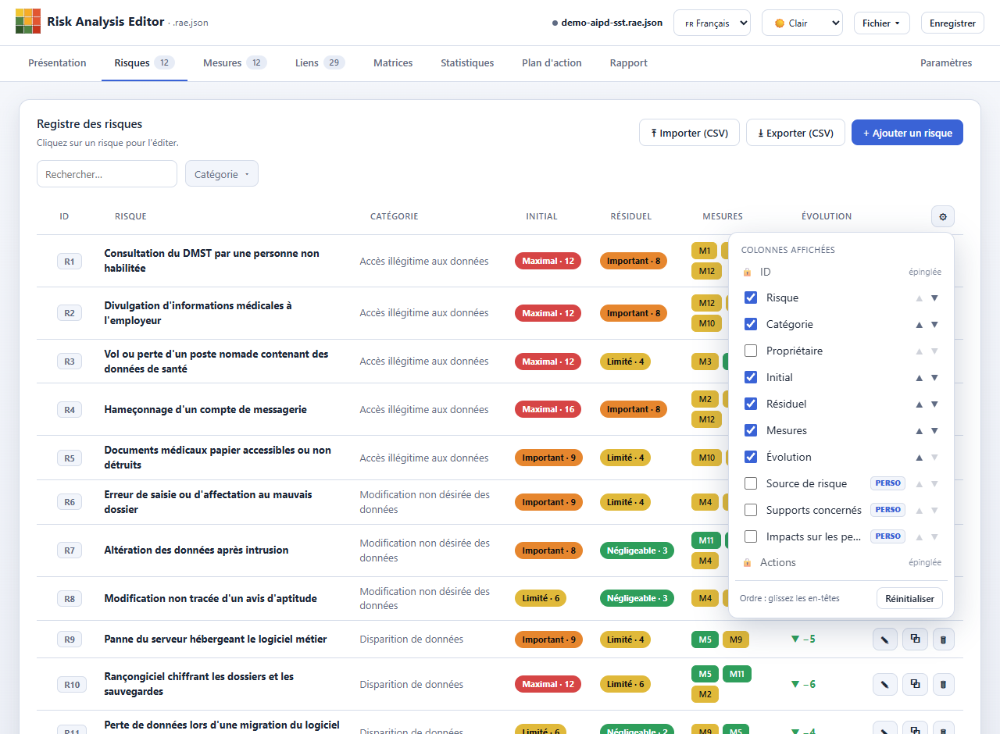

Vous pouvez y **afficher/masquer** chaque colonne (y compris les champs personnalisés, marqués *perso*), et les **réordonner** — soit par les flèches ▲/▼ du menu, soit en **glissant directement les en-têtes** dans le tableau. Les colonnes **ID** et **Actions** restent épinglées. La disposition est **enregistrée dans le fichier**.

---

## 17. Import et export CSV

Chaque registre (Risques, Mesures, Liens) propose **Importer (CSV)** et **Exporter (CSV)** ; l'onglet **Objets** propose les mêmes boutons **par type d'objet** (voir §15).

- **Export.** Les en-têtes sont les **clés anglaises** du format (identiques quelle que soit la langue de l'interface), avec délimiteur `;` et BOM UTF-8 pour Excel. Des colonnes dérivées en lecture seule sont ajoutées (score/criticité pour les risques ; risques couverts pour les mesures ; libellés pour les liens). Le fichier est **ré-importable**.
- **Import.** Les colonnes sont nommées d'après ces mêmes clés anglaises ; le séparateur est auto-détecté. Les risques et mesures sont **fusionnés par identifiant** ; les liens font l'objet d'un contrôle d'intégrité et d'une déduplication.
- **Champs personnalisés dans les CSV.** Les colonnes de champs personnalisés portent le **libellé** du champ. Les champs **calculés** sont exportés (leur valeur) mais **jamais réimportés** — dérivés, ils se recalculent. Les **échelles** s'exportent en libellé et se ré-importent par libellé ou valeur numérique. Les **références** s'exportent en libellés d'objets et se ré-importent par libellé ou identifiant (un libellé ambigu — doublon, ou contenant une virgule — peut ne pas être reconnu). Une **couleur** s'exporte et se ré-importe en hexadécimal (`#RRGGBB`). Une **image** exporte un simple marqueur `[image]` et **n'est pas réimportée** (le data-URI n'a pas sa place dans un tableur).

> Une **image** s'affiche en **vignette** dans les registres et le rapport **écran/PDF**. Dans l'export **Word**, elle est **embarquée** partout : registre natif, tableaux/notes d'objets, et gabarits personnalisés — que ce soit une valeur `{{ … .cf.<code> }}` (boucle de paragraphes ou de ligne de tableau) ou un bloc `{{ table … }}`. Dans une valeur de gabarit, on peut **dimensionner** l'image : `{{ risk.cf.photo width="4" }}` (4 cm de large, hauteur calculée) ou `height="…"`, comme les autres images de gabarit. Une **couleur** donne une **cellule teintée** (registre natif) ou une pastille ■ (gabarit), selon son mode d'affichage.

Le CSV est idéal pour préparer ou retravailler les données dans un tableur, puis les réinjecter.

---

## 18. Exports Word et Excel

Le menu **Fichier** propose deux exports bureautiques, générés **localement et hors-ligne** (le contenu de l'analyse n'est pas transmis à un service distant) :

- **Exporter en Word (.docx)** — suit la **même configuration** que le rapport (voir [§13](#13-le-rapport) : sections, ordre, colonnes, périmètre, orientation) et y ajoute une **page de garde**, une **table des matières** et un **en-tête / pied de page natifs** (avec numéros de page). Cartouche, présentation, synthèse, grille, **matrices en images**, registres et fiches détaillées. Prêt à fondre dans un gabarit d'entreprise. Également accessible via le bouton *⭳ Word* de l'onglet Rapport.
- **Exporter en Excel (.xlsx)** — un classeur à quatre feuilles (**Synthèse / Risques / Mesures / Liens**), avec cellules typées (vraies dates et nombres), couleurs de criticité et de statut, en-têtes figés et filtres automatiques.

### Exporter avec un modèle Word (gabarit personnalisé)

Au-delà de l'export Word « clé en main » ci-dessus, RAE peut **remplir votre propre modèle Word**. Vous préparez un document `.docx` à votre charte contenant des **balises** entre doubles accolades — `{{ analysis.title }}`, `{{#each risks}} … {{/each}}`, `{{ matrix }}`, `{{ radar }}`, `{{ stat }}`, `{{ table }}`… — que l'application remplace par les valeurs, tableaux, matrices, radars et graphiques de l'analyse. **Le modèle conserve entièrement sa mise en page** ; vous en maîtrisez donc la forme, au contraire de l'export natif qui suit la configuration de l'onglet Rapport.

- **Fichier › Exporter avec un modèle Word…**, choisissez votre `.docx` : le rapport rempli est téléchargé. Un **rapport d'avertissements** signale en fin de génération les balises non reconnues ou les champs absents.
- Des **modèles prêts à l'emploi** (classique, éclaté par catégorie, référentiels, tableau de bord, et des reproductions fidèles du rapport natif) sont fournis dans le dossier [`word-templates/`](../word-templates/), en versions **propre** et **annotée** (les annotées expliquent chaque balise — à consulter pour apprendre, mais à ne pas exporter telles quelles).
- Pour créer le vôtre : suivez le **[guide de rédaction des modèles](../word-templates/guide-redaction-modeles.md)** (tutoriel pas à pas) et gardez le **[catalogue des mots-clés](../word-templates/catalogue-mots-cles-rapport.md)** comme référence (toutes les balises, blocs, boucles, conditions, filtres et formats).

---

## 19. Gérer les fichiers et les modèles

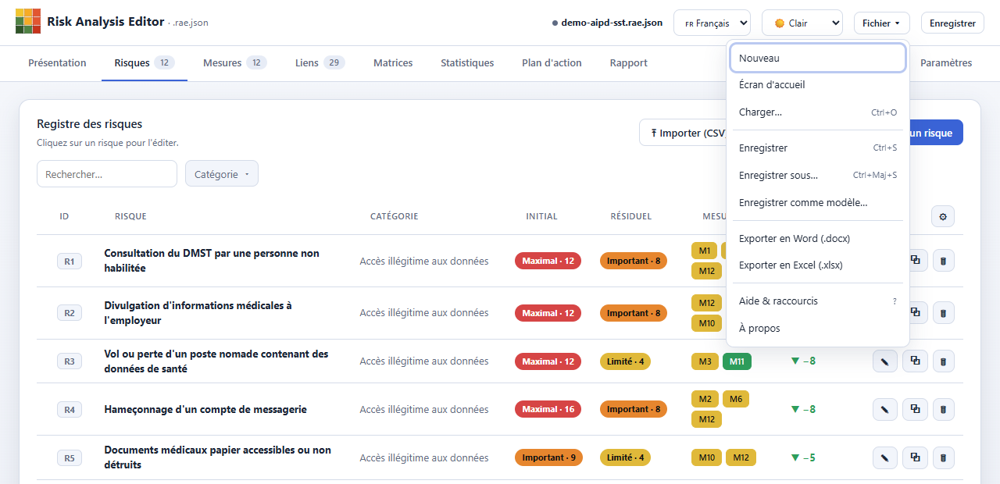

Le menu **Fichier** rassemble :

- **Nouveau** — repart d'une analyse vierge (avec confirmation si des modifications sont en cours) ;
- **Écran d'accueil** — revient au bloc d'amorçage ;
- **Charger…** (`Ctrl+O`) — ouvre un fichier `.rae.json`. Vous pouvez aussi **glisser-déposer** un fichier `.rae.json` sur la fenêtre ;
- **Enregistrer** (`Ctrl+S`) et **Enregistrer sous…** (`Ctrl+Maj+S`) ;
- **Enregistrer comme modèle…** — exporte un squelette (grille + champs personnalisés, sans risques ni mesures) réutilisable comme point de départ ;
- **Exporter en Word / Excel** (voir §18) ;
- **À propos** (version de l'application) et **Aide & raccourcis**.

**Modèles méthodologiques.** L'écran d'accueil propose de démarrer d'un modèle (EBIOS RM, AIPD — CNIL PIA, ISO 27005, générique). Ouvrir un modèle démarre une **nouvelle analyse non reliée** : votre travail ne remplace jamais le modèle.

**Chargement par l'adresse.** Servi en HTTP(S), l'outil accepte des paramètres d'URL : `?file=…` (charger une analyse), `?lang=fr|en|it`, `?tab=<onglet>[.<sous-onglet>]`, `?filter=code:valeur;…`. Exemple : `…?tab=matrices.traj` ouvre directement la vue Trajectoire.

---

## 20. Raccourcis clavier et accessibilité

Un panneau récapitule les gestes et raccourcis : menu **Fichier › Aide & raccourcis**, ou la touche **`?`**.

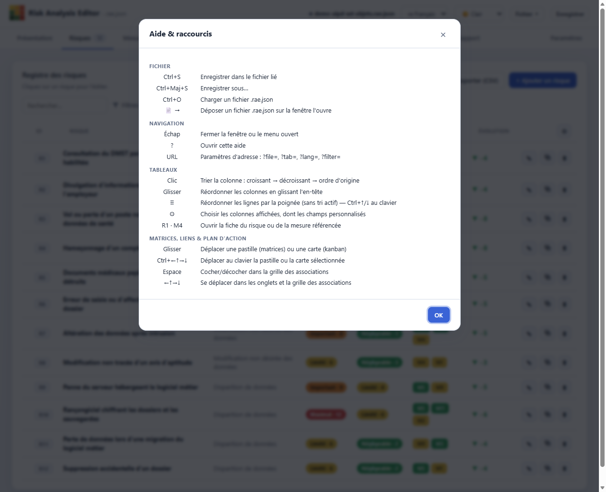

Principaux raccourcis :

| Raccourci | Action |
|---|---|
| `Ctrl+S` / `Ctrl+Maj+S` | Enregistrer / Enregistrer sous |
| `Ctrl+O` | Charger un fichier |
| `Échap` | Fermer la fenêtre ou le menu ouvert |
| `?` | Ouvrir l'aide |
| Clic sur l'en-tête | Trier (croissant → décroissant → ordre d'origine) |
| Glisser l'en-tête | Réordonner les colonnes |
| Glisser la poignée ⠿ / `Ctrl+↑`·`Ctrl+↓` | Réordonner les lignes (sans tri actif) |
| `Ctrl+flèches` | Déplacer une pastille (matrices) ou une carte (kanban) |
| Flèches / `Espace` | Se déplacer / cocher dans la grille des associations |

**Accessibilité.** L'outil est utilisable au clavier (onglets, grilles, alternatives au glisser-déposer), les boutons à icône portent des noms accessibles, le focus est visible, et un mode de **contraste renforcé (WCAG AA)** est disponible pour les étiquettes colorées (voir §4).

---

## 21. Compatibilité navigateurs

L'application fonctionne dans un navigateur de bureau récent, sans installation ni serveur. Les tests sont réalisés principalement avec **Microsoft Edge (Chromium)** ; tout navigateur basé sur Chromium offre l'expérience complète.

- **Firefox / Safari** : l'enregistrement direct dans le fichier ouvert n'est pas disponible ; *Enregistrer* se replie sur un **téléchargement** du `.rae.json` (et *Charger* sur un sélecteur de fichier classique). Tout le reste est identique.
- Le **chargement par URL** (`?file=…`) et le bouton **Ouvrir une analyse de démonstration** nécessitent que l'outil soit servi en HTTP(S) ; en ouverture directe du fichier (`file://`), le bouton de démonstration n'apparaît pas — utilisez *Charger*, le glisser-déposer ou un **modèle** (les modèles restent disponibles hors-ligne).

Le détail figure dans le [README](../README.fr.md#compatibilité-navigateurs).

---

## 22. Format de fichier et interopérabilité

Une analyse est un unique fichier **`.rae.json`** (JSON lisible) contenant la grille, les risques, les mesures, les liens, les cotations, les champs personnalisés ainsi que les **types d'objets** (`object_types`) et leurs **instances** (`objects`). Les **noms de propriétés sont en anglais** ; les **valeurs** (libellés, descriptions) restent dans la langue de l'analyse. Le format est **ouvert et spécifié**, ce qui permet de le produire ou de le consommer avec d'autres outils.

La spécification complète et le schéma JSON de validation se trouvent dans le dossier [`specs/`](../specs/) :

- [`specs/SPEC-format-analyse-risque.md`](../specs/SPEC-format-analyse-risque.md) — spécification détaillée ;
- [`specs/schema-analyse-risque.json`](../specs/schema-analyse-risque.json) — schéma JSON.

---

## 23. Questions fréquentes et astuces

**Où sont enregistrées mes données ?**
Uniquement dans le fichier `.rae.json` que vous enregistrez, sur votre poste. L'outil fonctionne hors-ligne et ne transmet pas le contenu de vos analyses à un service distant, exports Word/Excel compris.

**Comment revenir à l'ordre d'origine après avoir trié une colonne ?**
Cliquez une troisième fois sur l'en-tête : le tri cycle croissant → décroissant → **ordre d'origine**.

**J'ai supprimé un risque par erreur.**
Cliquez sur **« Annuler »** dans le message qui apparaît juste après la suppression ; la fiche et ses liens sont restaurés.

**Pourquoi ne puis-je pas réordonner les lignes ?**
Le réordonnancement par poignée n'est possible que **sans tri de colonne actif**. Ramenez le tri à l'ordre d'origine (voir ci-dessus).

**Comment adapter l'outil à ma méthode (EBIOS RM, ISO 27005…) ?**
Configurez la **grille de cotation** (§4) et créez des **champs personnalisés** (§14) pour les notions propres à votre méthode (source de risque, biens supports, événement redouté…). Vous pouvez partir d'un **modèle** fourni.

**La modification de ma grille a changé les cotations affichées.**
C'est attendu : le score et la criticité sont **recalculés** à partir de la grille. Fixez la grille avant de coter, ou tenez compte du bandeau d'avertissement.

---

*Ce guide correspond à Risk Analysis Editor version 2.0.0. Les captures illustrent l'analyse de démonstration fictive `examples/demo-aipd-sst.rae.json`.*
